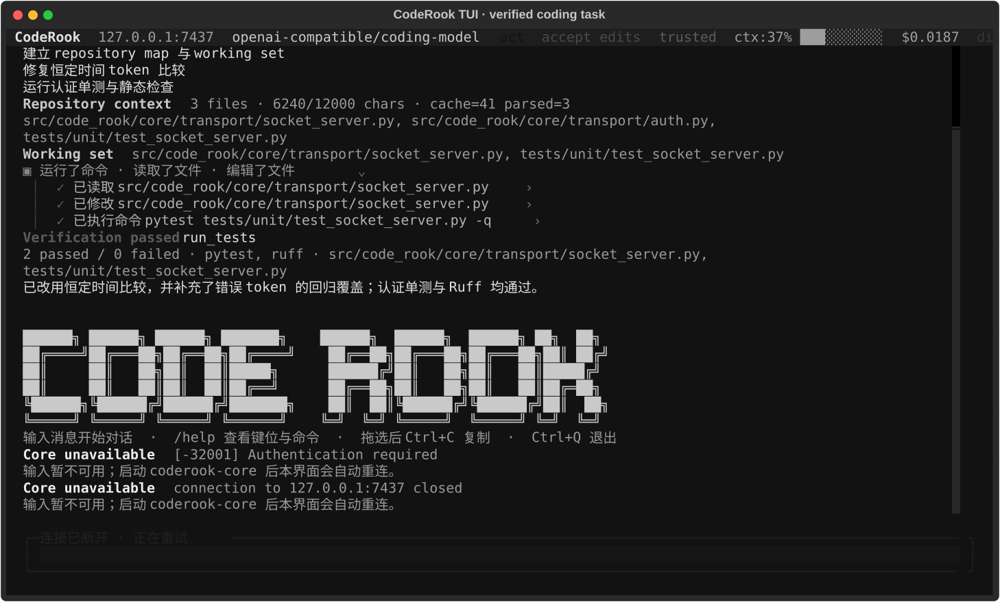
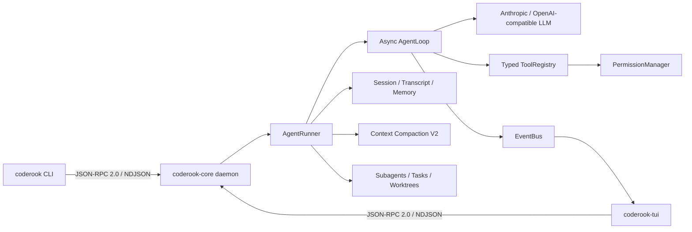

# CodeRook

CodeRook 是一个使用 Python 3.12 构建的本地 AI 编程 Agent 运行时。它采用 `coderook-core` 常驻守护进程与 CLI/TUI 客户端分离的双进程架构，在一条可观测、可恢复、受权限约束的执行链路中完成模型调用、工具执行、会话持久化、上下文压缩和多 Agent 协作。

它不是一次性调用大模型的聊天 Demo。项目重点是 Coding Agent 背后的工程系统：类型化协议、异步运行时、工具安全、上下文治理、任务隔离和故障恢复。



## 核心架构



Core daemon 负责持有 Agent、会话、后台任务和权限状态；CLI 与 TUI 只是客户端。前端退出不会改变协议边界，后续也可以在相同 IPC 之上增加 Web 或 IDE 客户端。

## 主要能力

| 领域 | 当前实现 |
|---|---|
| Agent Loop | 异步 Plan-Act-Observe 循环、只读工具批量并行、Todo 软状态机、限流退避与上下文溢出恢复 |
| 类型化协议 | Pydantic v2 命令/事件模型、JSON-RPC 2.0、NDJSON 流、自动生成协议文档 |
| 本地安全 | loopback 限制、首帧 token 认证、工作区边界、参数校验、交互审批与 headless 权限模式 |
| 代码工具 | 稳定的 `File`、`Git`、`Run`、`Bash` action-family；Checkpoint/Rewind 与旧 transcript replay 兼容 |
| 会话系统 | 多轮 thread、block 级 transcript、崩溃尾部恢复、会话恢复/分叉/导出/删除 |
| 长期记忆 | 项目级 JSON 记录、Markdown 索引、来源追踪、敏感信息脱敏和中英文词法召回 |
| 上下文治理 | 80% 自动压缩、最近窗口保留、结构化摘要、质量门禁、工具输出分级和增量压缩 |
| 多 Agent | 角色模型覆盖、只读 reviewer、共享任务板、跨 turn 后台任务和 Git worktree 隔离 |
| 扩展机制 | Skills、MCP 工具接入、UserPromptSubmit/PreToolUse/PostToolUse/Stop 异步 Hooks |
| 可观测性 | TUI 实时事件、token 水位、工具与审批状态、压缩指标、events.jsonl 和脱敏 Trace |

## 快速开始

如果只想安装并开始使用，请直接阅读
[《CodeRook 使用说明》](docs/USER_GUIDE.md)，其中包含首次配置、快捷键、模型切换、
权限模式、Plan Mode、会话恢复和常见问题。

### 环境要求

- Python `3.12`
- [uv](https://docs.astral.sh/uv/)
- Git

### 1. 安装依赖

```powershell
git clone https://github.com/kyletser/coderook.git
cd coderook
uv sync
Copy-Item .env.example .env
```

macOS/Linux 可使用：

```bash
cp .env.example .env
```

### 2. 配置模型

推荐使用交互式向导：

```powershell
uv run coderook configure
```

向导支持：

- Anthropic-compatible：官方 Anthropic 或自定义兼容 `Base URL`
- OpenAI-compatible：完整的 `/v1/chat/completions` 地址
- 隐藏输入和更新 API key
- 为两种协议分别保留 API key，切换时互不覆盖
- 修改配置后自动重启由 CodeRook 管理的 Core

普通配置保存在 `~/.coderook/config.toml`，密钥单独保存在
`~/.coderook/credentials.json`，不会写入仓库或日志。若项目已有 `.env`，向导会同步其中的
非敏感 LLM 参数，并把旧明文 key 迁移到凭据文件。

查看当前配置（不会显示密钥正文）：

```powershell
uv run coderook config-status
```

也可以继续使用 `.env` 或系统环境变量；环境变量优先级最高。OpenCode Zen 示例：

```dotenv
CODEROOK_LLM_PROVIDER=openai_compatible
CODEROOK_LLM_BASE_URL=https://opencode.ai/zen/go/v1/chat/completions
CODEROOK_LLM_API_KEY_ENV=CODEROOK_LLM_API_KEY
CODEROOK_LLM_API_KEY=replace-with-your-key
CODEROOK_LLM_DEFAULT_MODEL=deepseek-v4-pro
```

### 3. 一条命令启动

```powershell
uv run coderook
```

无参数 `coderook` 会进入 TUI，并自动复用已有 Core；若 Core 未运行，则在后台启动并等待认证就绪。
首次没有可用 LLM 配置时，会先进入 API 配置向导。TUI 内输入 `/config` 可以直接选择
DeepSeek、OpenAI、Anthropic 或硅基流动，输入 API Key 后会探测该账号真实可用的模型；
选择完成后自动重启 Core 并恢复当前会话。

`coderook-tui` 入口继续保留。排障或需要手动管理生命周期时，可使用：

```powershell
uv run coderook core start
uv run coderook core status
uv run coderook core restart
uv run coderook core stop
uv run coderook-tui --no-auto-core
```

## 使用方式

### TUI

TUI 是项目的主要交互界面，支持流式响应、工具调用折叠块、权限审批、上下文水位和后台任务事件。

| 命令 | 作用 |
|---|---|
| `/new` | 创建并切换到新会话 |
| `/sessions` | 打开历史会话选择器 |
| `/model` | 打开模型选择器，选择后保存默认模型、重启 Core 并恢复当前会话 |
| `/model <模型 ID>` | 直接新增并切换到该模型 |
| `/model add <模型 ID>` | 新增自定义模型并立即切换 |
| `/config` | 在当前页面选择 API 平台、填写 API Key 并探测可用模型 |
| `/compact` | 手动执行结构化上下文压缩 |
| `/mode plan\|act\|operate` | 独立查看或切换工作模式，`Tab` 循环 |
| `/permissions ask\|auto-review\|full-access` | 独立查看或切换权限姿态，`Shift+Tab` 循环 |
| `/trust status\|grant\|revoke` | 查看或修改工作区信任状态 |
| `/sandbox status` | 查看真实 OS 隔离能力 |
| `/skills list\|show\|install\|remove\|audit` | 管理带 provenance 和 digest 校验的 Skills |
| `/skill_name` | 调用已安装 Skill |
| `Ctrl+Q` | 退出 TUI |

### CLI

CLI 适合脚本、调试和无人值守任务：

```powershell
uv run coderook ping
uv run coderook chat
uv run coderook run --goal "分析项目并运行测试"
uv run coderook sessions --all
uv run coderook skills audit
uv run coderook trace --follow
```

Headless 任务默认采用 `fail-fast`：遇到需要人工审批的工具立即退出。明确允许自动执行的工具时使用 allow-list：

```powershell
uv run coderook run --goal "修改并验证代码" `
  --permission-mode allow-list `
  --allow-tool edit_file `
  --allow-tool apply_patch `
  --allow-tool Bash.run
```

allow-list 仍不能绕过危险命令规则和工作区边界。

### 会话管理

```powershell
uv run coderook sessions --all
uv run coderook chat --resume SESSION_ID
uv run coderook session rename SESSION_ID "新标题"
uv run coderook session fork SESSION_ID --title "实验分支"
uv run coderook session export SESSION_ID --format markdown -o session.md
uv run coderook session delete SESSION_ID --yes
```

## 上下文压缩 V2

CodeRook 不会在窗口耗尽时简单删除最早消息。默认策略是：

1. 小型工具输出保留原文，中型输出保留头尾，超大输出优先由 LLM 蒸馏。
2. 将 `tool_use` 与 `tool_result` 视为不可拆分的协议闭环。
3. 保留约 25% 最近消息原文，只压缩较旧历史。
4. 要求模型生成目标、完成项、约束、决策、文件、TODO、错误和关键数据的 JSON 摘要。
5. 使用 Pydantic 校验结构，并检查约束、TODO、错误和文件路径是否丢失。
6. 后续压缩增量合并上一版摘要，不重复处理完整 transcript。
7. TUI 展示触发原因、压缩前后 token、保留消息数、质量分和摘要文件路径。

```toml
[compaction]
auto_threshold = 0.80
retain_ratio = 0.25
tool_result_limit = 8000
tool_result_keep = 4000
tool_result_summarize_threshold = 20000
```

## 记忆与任务隔离

长期记忆写入 `.coderook/memory/`，支持 `memory_save`、`memory_search` 和 `memory_forget`。当前检索使用确定性的中英文词法打分，没有引入向量数据库或外部 embedding 服务。

复杂任务可以通过任务系统和子 Agent 拆分。`task_claim` 提供原子认领；worktree 工具将并行修改限制在 `.coderook/worktrees/`；子 Agent 的文件、Bash、Git 和 Checkpoint 工具都会绑定到指定 worktree。

后台命令由 daemon 级注册表持有，因此可以跨对话轮次查询和取消；daemon 退出时会清理关联进程树。

## 项目结构

```text
src/code_rook/
├── cli/                 # CLI 命令与 IPC 客户端
├── tui/                 # Textual 终端界面
└── core/
    ├── bus/             # 类型化命令、事件与 JSON-RPC envelope
    ├── transport/       # TCP NDJSON server/client 与认证
    ├── compact/         # 上下文预算、结构化摘要和协议校验
    ├── tools/           # 工具注册、调用、权限与内置工具
    ├── session/         # 会话、transcript、导出和恢复
    ├── memory/          # 项目长期记忆
    ├── background/      # daemon 级后台任务
    ├── task/            # 多 Agent 任务状态
    ├── worktree/        # Git worktree 生命周期
    ├── subagent/        # 持久 Worker、写入声明、租约、预算与统一 agent actions
    ├── hooks/           # 异步生命周期扩展点
    ├── skills/          # Skill 加载
    └── mcp/             # MCP server 管理
```

## 开发与验证

```powershell
uv run ruff check .
uv run python scripts\check_brand.py
uv run mypy src
uv run pytest -q
uv run python scripts\gen_protocol_doc.py --check
```

完整发布前门禁：

```powershell
make verify
```

当前测试基线为 `635 passed, 3 skipped`。测试覆盖协议、传输、Agent Loop、工具权限、action-family、上下文压缩、会话恢复、记忆、后台任务、品牌迁移和 worktree 管理。

## 设计文档

- [技术架构](TECH_ARCHITECTURE.md)
- [Wire Protocol](WIRE_PROTOCOL.md)
- [运行手册](RUNBOOK.md)
- [轻量 Agent 完成度审计](docs/LIGHTWEIGHT_AGENT_COMPLETION_AUDIT.md)
- [与 Claude Code 的差距分析](docs/CODEROOK_VS_CLAUDE_CODE_GAP_ANALYSIS.md)
- [learn-claude-code 机制移植说明](docs/LEARN_CLAUDE_CODE_PORT.md)

## 项目定位

CodeRook 适合作为 AI Agent 工程方向的学习与求职项目，因为它能够完整讨论以下问题：

- 为什么采用 daemon + client，而不是单进程脚本？
- 如何保证工具调用的类型安全、权限安全和文件事务安全？
- 如何让长会话在压缩、崩溃和取消后继续运行？
- 如何隔离并行子 Agent 的代码修改？
- 如何用事件、Trace 和测试证明 Agent 不是黑盒？

项目仍是面向学习和本地开发的 mini Coding Agent，不宣称一比一复刻 Claude Code 或 Codex。

## License

[MIT](LICENSE)
