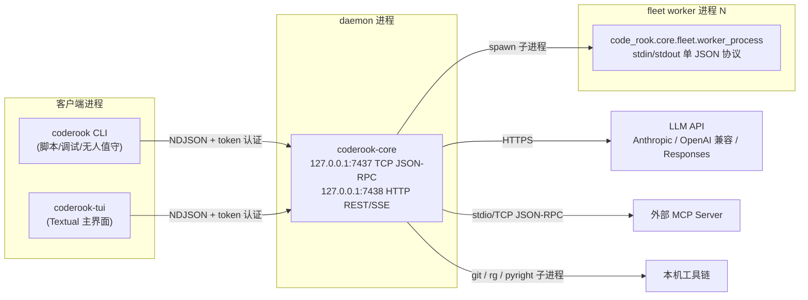
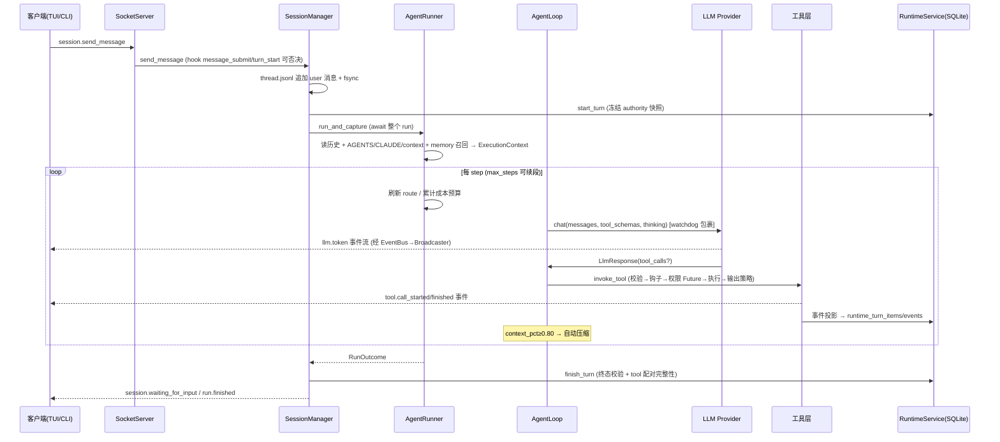

# CodeRook 功能架构文档

**版本**：1.3
**基准日期**：2026-08-18
**代码基线**：`CodeRook 0.1.0`（工作树；本文档按当前代码与 R0–R5 生产就绪改造校准）
**状态**：Current
**适用读者**：新加入的工程师、AI Agent、架构评审者

> 说明：本文档以代码为准。v1.3 吸收 Stage 0–4 与 R0–R5 的仓库内实现；真实模型、跨平台
> 沙箱、分发物和外部协议兼容报告仍按发布门禁单独取证。各项最新边界见 §20 和发布评分卡。

---

## 目录

1. [执行摘要](#1-执行摘要)
2. [系统上下文与进程拓扑](#2-系统上下文与进程拓扑)
3. [架构总览](#3-架构总览)
4. [协议层（core/bus）](#4-协议层corebus)
5. [传输与接口层（core/transport、core/api）](#5-传输与接口层coretransportcoreapi)
6. [配置系统（core/config.py）](#6-配置系统coreconfigpy)
7. [Daemon 装配与生命周期（core/app.py）](#7-daemon-装配与生命周期coreapppy)
8. [Agent 运行时（loop / runner / context / interaction）](#8-agent-运行时loop--runner--context--interaction)
9. [工具框架（core/tools）](#9-工具框架coretools)
10. [权限与授权（permissions / authority / sandbox）](#10-权限与授权permissions--authority--sandbox)
11. [LLM 接入层（core/llm）](#11-llm-接入层corellm)
12. [会话与持久化（session / runtime / checkpoints / artifacts / memory）](#12-会话与持久化session--runtime--checkpoints--artifacts--memory)
13. [多 Agent 与工作流（task / goal / subagent / fleet / workflow）](#13-多-agent-与工作流task--goal--subagent--fleet--workflow)
14. [扩展机制（skills / hooks / mcp / agents）](#14-扩展机制skills--hooks--mcp--agents)
15. [可观测性（events / trace / receipts / fingerprint）](#15-可观测性events--trace--receipts--fingerprint)
16. [关键数据流](#16-关键数据流)
17. [客户端层（CLI / TUI）](#17-客户端层cli--tui)
18. [测试与质量门禁](#18-测试与质量门禁)
19. [工程约定](#19-工程约定)
20. [已知问题与技术债（诚实清单）](#20-已知问题与技术债诚实清单)
21. [文档与代码的不一致](#21-文档与代码的不一致)
- [附录 A：目录结构](#附录-a目录结构)
- [附录 B：环境变量清单](#附录-b环境变量清单)
- [附录 C：术语表](#附录-c术语表)

---

## 1. 执行摘要

### 1.1 系统定位

CodeRook 是一个**本地 AI 编程 Agent 运行时**（Python 3.12），不是聊天 Demo。它的核心命题是：
把 Coding Agent 背后的工程系统——类型化协议、异步运行时、工具安全、上下文治理、任务隔离、
故障恢复——做成可测试、可审计、可恢复的一等公民。

系统采用**双进程架构**：`coderook-core` 是常驻守护进程（daemon），持有会话、Agent、后台任务、
权限与持久化状态；`coderook`（CLI）与 `coderook-tui`（Textual TUI）只是通过 loopback TCP
连接 daemon 的瘦客户端。前端退出不会丢失任何运行状态。

### 1.2 核心能力矩阵

| 领域 | 实现要点 |
|---|---|
| Agent Loop | 异步 Plan-Act-Observe 循环（默认 20 步，可自动/交互续段）、资源声明驱动的并行工具批、每步路由刷新、Todo 软状态机、限流退避、上下文溢出反应式压缩 |
| 类型化协议 | Pydantic v2 判别联合命令/事件模型、JSON-RPC 2.0 over NDJSON、`WIRE_PROTOCOL.md` 自动生成与 CI 契约校验 |
| 本地安全 | loopback 强制、首帧 IPC token 认证、工作区边界、六层权限决策、命令前缀放行、Linux bwrap/macOS Seatbelt 执行包装（Windows 明确降级） |
| 代码工具 | Repository 仓库地图/符号/引用、File/Git/Bash/Run action-family、WebFetch/WebSearch、一次性图片输入、隔离/持久 shell、Python/TypeScript 编辑后诊断、Checkpoint/Rewind |
| 会话系统 | block 级增量 transcript、崩溃尾部恢复、会话 resume/fork/export/delete、SQLite durable runtime 投影 |
| 上下文治理 | 80% 自动压缩、25% 最近窗口保留、结构化 JSON 摘要 + 质量门禁、工具输出蒸馏/截断/artifact 溢出三级预算 |
| 多 Agent | 子代理权限收窄、写声明（WriteClaim）静态冲突检测、token 预算共享、心跳租约、Git worktree 隔离 |
| 工作流 | 声明式 JSON/TOML IR（sequence/parallel/branch/retry/review_gate/fan_in）、SQLite 事件溯源账本、崩溃恢复幂等重放 |
| 模型经济性 | thinking/reasoning 档位、用户可覆盖的模型单价、会话成本与缓存节省展示、static/rule_based/cost_budget 路由 |
| 扩展机制 | Skills（digest 完整性校验）、11 个生命周期 Hooks、MCP 客户端、planner/executor/reviewer 角色 profile，以及 TUI 管理入口 |
| 可观测性 | 类型化事件、durable usage/cost/路由证据、脱敏 Trace（10MB×5 轮转）、Turn Receipt 离线重建、prompt 前缀指纹 |

### 1.3 技术栈

- **语言/运行**：Python 3.12（`>=3.12,<3.13` 精确锁定）、asyncio、uv 包管理、Hatchling 构建
- **核心库**：pydantic v2（协议与校验）、anthropic SDK（流式）、httpx[socks]（OpenAI 兼容协议）、textual（TUI）、keyring（凭证）、pathspec（gitignore 语义）、unidiff（patch 解析）、python-dotenv
- **存储**：文件系统账本（JSONL/JSON）+ SQLite（runtime.db / fleet.db / workflow.db），无外部数据库依赖
- **质量链**：ruff、mypy strict（本机 + `--platform linux`）、pytest + pytest-asyncio、Linux/macOS/Windows CI、quick/nightly/release benchmark 工作流

### 1.4 工程规模快照

- 三个可执行入口：`coderook` / `coderook-core` / `coderook-tui`；另提供 Python SDK 与 VS Code 原型
- 协议模型与 daemon handler 以 `WIRE_PROTOCOL.md` 和 `CoreApp` 注册表为准，不在手写文档固化易漂移计数
- 单元、集成、golden、benchmark 四层证据；真实 provider 与跨平台发行证据在发布评分卡单独登记
- TUI 的连接、命令、IPC、渲染、管理面板和控件已拆出独立模块，`app.py` 仍是主要编排器

---

## 2. 系统上下文与进程拓扑

### 2.1 进程模型



四种进程角色：

| 进程 | 生命周期 | 职责 |
|---|---|---|
| `coderook-core` | 常驻 daemon，由 TUI/`core start` 自动拉起或手动启动；PID 文件 `~/.coderook/coderook-core.pid` | 唯一的状态持有者：会话、Agent run、后台任务、权限、持久化 |
| `coderook` / `coderook-tui` | 随用户终端 | 瘦客户端：发命令、订阅事件、渲染；断线自动重连恢复会话 |
| fleet worker | 由 workflow 执行器按需 spawn，任务结束即退出 | 在独立进程内跑完整 `AgentRunner.run_and_capture`，headless 权限（fail_fast） |

外部消费者以 `/v1/capabilities` 和 `X-CodeRook-API-Version` 协商 HTTP/SSE 版本；Python SDK
同步/异步客户端都暴露 `capabilities()` 与 `usage()`。`stream-json` 每行携带 schema version，
公共接口的兼容变化、错误稳定边界和“两 minor 且不少于 90 天”弃用窗口由
`docs/COMPATIBILITY.md` 统一定义。
| hooks/MCP/git/rg/pyright/tsc 子进程 | 瞬态 | 由 daemon 或工具层按需拉起，全部有超时与进程树终止保护 |

### 2.2 端口与本地端点

| 端点 | 默认值 | 协议 | 认证 |
|---|---|---|---|
| IPC | `127.0.0.1:7437` | TCP + NDJSON + JSON-RPC 2.0 | 首帧 `core.authenticate`，token 来自 `~/.coderook/ipc-token`（0600）或 `CODEROOK_IPC_TOKEN` |
| Runtime HTTP API | `127.0.0.1:7438` | 手写 HTTP/1.1 + SSE | 强制 Bearer token；未配置时自动创建 `~/.coderook/api-token`，非 loopback 绑定仍额外受 host 校验约束 |

`require_loopback_host()` 在 daemon 启动与 SocketServer 启动两处强制 host 必须是回环地址，
且 SocketServer 对每个连接做 peer 地址回环复检——双重防线。

### 2.3 外部依赖

| 依赖 | 用途 | 缺失时行为 |
|---|---|---|
| LLM API（Anthropic/OpenAI 兼容/Responses） | 模型推理 | `doctor` 分类诊断（credential/tls/network/model/schema），run 失败 |
| git | worktree、Git 家族工具、结构化 diff | 相关工具返回错误，不影响其余功能 |
| ripgrep（可选） | glob/grep 加速后端 | 自动回退 Python 遍历实现 |
| pyright/basedpyright、tsc/npx（可选） | 编辑后 Python/TypeScript 诊断 | 对应语言诊断降级为 `unavailable`，不阻断 |
| OS keyring（可选） | API key 首选存储 | 告警后回退 `~/.coderook/credentials.json`（0600） |
| bwrap / sandbox-exec（可选） | AUTO_REVIEW shell 的真实 OS 执行包装 | Linux/macOS 可用时施加只读/工作区写沙箱；Windows 或缺失后端时明确降级并回到审批链 |

---

## 3. 架构总览

### 3.1 分层架构

```
┌─────────────────────────────────────────────────────────────────────┐
│ 客户端层        coderook CLI │ coderook-tui (Textual) │ HTTP 外部集成 │
├─────────────────────────────────────────────────────────────────────┤
│ 接口层          SocketServer(TCP 7437) │ HttpApiServer(7438)         │
│                 IpcEventBroadcaster │ token/Bearer 认证 │ trace 记录  │
├─────────────────────────────────────────────────────────────────────┤
│ 编排层          SessionManager │ AgentRunner │ AgentLoop │ LocalFleet │
│                 InteractionManager │ BackgroundTaskRegistry(×2)      │
├─────────────────────────────────────────────────────────────────────┤
│ 领域子系统层                                                         │
│  tools(注册/调用/Web/图片/shell) llm(routes/pricing/router/providers)  │
│  permissions+authority+sandbox session+runtime(双真源持久化)          │
│  compact(上下文治理)           subagent/fleet/workflow(多Agent)       │
│  skills/hooks/mcp/agents(扩展) checkpoints/artifacts/memory(资产)    │
├─────────────────────────────────────────────────────────────────────┤
│ 横切层          EventBus(45 事件) │ TraceWriter(脱敏) │ HookManager   │
│                 WorkspaceBoundary │ 原子文件写原语 │ 进程树管理        │
├─────────────────────────────────────────────────────────────────────┤
│ 持久层          ~/.coderook/(sessions/, runtime.db, fleet.db,        │
│                 workflow.db, routes.json, credentials, policy.toml…) │
│                 <workspace>/.coderook/(memory/, artifacts/, skills/) │
└─────────────────────────────────────────────────────────────────────┘
```

### 3.2 架构风格与核心原则

1. **协议先行（typed protocol-first）**：一切跨进程交互先定义 pydantic 模型。IPC 命令、事件、
   工具参数、workflow IR、worker 记录全部是 `frozen + extra="forbid"` 的强类型模型；
   `WIRE_PROTOCOL.md` 由模型生成并在 CI 中 `--check` 防止漂移。
2. **事件溯源 + 双真源**：会话的"操作真源"是文件账本（thread.jsonl/meta.json），
   runtime.db 是"可查询/可审计投影"（每 thread 单调 seq 的事件账本）；workflow 与 worker
   控制面同样是事件账本 + 纯函数 reducer 重建状态。
3. **durable 优先，崩溃可恢复**：三层恢复互相兜底——SQLite 孤儿 turn 修复（boot_id 判别）、
   transcript 尾部截断恢复（归档原文 + 审计）、workflow/worker 的 interrupted 重放。
4. **fail-closed 安全默认**：未登记工具默认 ASK；未声明副作用的工具按 EXTERNAL_WRITE 保守处理；
   未知 authority action 直接 DENY；skill digest 不匹配拒绝注入模型。
5. **有界性贯穿始终**：所有跨边界内容都有硬上限——bash 输出 64KB/120s、git 读取 200KB/15s、
   读文件 512KB、patch 1MB/100 文件/1000 hunks、worker 事件摘要 ≤500 字符、结果五段 ≤20 条×500 字符、
   工具输出 soft 20,000 / hard 100,000 字节溢出到内容寻址 artifact。
6. **权限只能收窄**：子代理 authority = 父快照 ∩ profile ceiling ∩ 请求范围；workflow 节点不能
   漂移出 FleetProfile 固定的 route/model/authority；写声明在 spawn 与解析两个时机静态校验。

---

## 4. 协议层（core/bus）

协议层是系统的契约边界，由三个文件组成：

### 4.1 JSON-RPC envelope（envelope.py）

`JsonRpcRequest{id, method, params}`、`JsonRpcSuccess{id, result}`、`JsonRpcError{id, error{code, message, data}}`，
外加服务端主动推送的 `EventPushEnvelope{kind:"event", event:{...}}`。
错误码：标准 JSON-RPC 五码（-32700/-32600/-32601/-32602/-32603）+ 自定义
`AUTH_REQUIRED=-32001`、`AUTH_FAILED=-32002`；业务层错误（如 SESSION_NOT_FOUND=-32010 等）
由各子系统通过 `HandlerError(code, message, data)` 抛出，由传输层统一转译为结构化错误响应。

### 4.2 命令联合（commands.py）

命令模型按 `type` 字段构成判别联合（`Annotated[Union[...], Discriminator("type")]`）；
`core.authenticate` 由传输层在认证阶段特殊处理，其余业务命令由 daemon 注册。按域分组：

| 域 | 命令 |
|---|---|
| 核心 | `core.authenticate`、`core.ping`、`runtime.capabilities` |
| 一次性 run | `agent.run`（headless，带 permission_mode + allow_tools）、`run.cancel`、`run.steer` |
| 事件 | `event.subscribe`（fnmatch topics + scope + replay_from_run 或 thread_id+after_seq，二者互斥由校验器强制）、`event.replay`（按 seq 游标分页） |
| durable thread/turn | `thread.create/list/get/update/archive`、`turn.start/get/list/interrupt/steer/items`、`turn.inspect`（turn+items+events+receipt 审计四件套） |
| session | `session.create/send_message/get_history/list/resume/rename/fork/export/delete/close/compact/tasks/checkpoints/rewind/context` |
| 权限与交互 | `session.get_authority/set_authority`（四维快照，busy 时禁止修改）、`permission.respond`（tool_use_id + 四级决策）、`user_question.respond` |
| 多 Agent | `worker.list/cancel`、`workflow.start/list/get` |
| 工作区 | `workspace.diff`（结构化 git diff） |
| 管理面 | `mcp.list`、`hooks.list/rerun`、`memory.list/delete`、`background.get/cancel`、`artifact.list/show/delete/gc` |

命令参数全部有边界约束（如 `content ≤100_000`、`limit 1..200`、workflow source ≤1MB）。

### 4.3 事件联合（events.py）

事件模型全部带 `type` Literal 判别字段，并组成同一判别联合：

| 族 | 事件 |
|---|---|
| 生命周期 | `core.started`、`run.started/finished/steered`、`step.started/finished`、`session.created/message_received/waiting_for_input/resumed/renamed/forked/deleted/interrupted/closed` |
| Agent 决策 | `agent.decision`（规则归纳的 intent：delegate/change/plan/inspect/execute/respond）、`agent.stuck` |
| 工具 | `tool.call_started/call_finished/call_failed` |
| LLM | `llm.token/reasoning/usage/model_selected/route_selected/retry` |
| 上下文 | `context.compacted/prefix_fingerprint/working_set/budget` |
| 权限与交互 | `permission.requested/granted/denied`、`user_question.asked` |
| 规划 | `plan.ready/updated` |
| 多 Agent | `subagent.started/finished`、`background.started/finished`、`worker.*`（registry 持久层） |
| 扩展与横切 | `skill.invoked`、`hook.executed`、`lsp.diagnostics`、`log.line`、`runtime.event`（durable 事件的 IPC 包装） |

### 4.4 协议文档契约

`scripts/gen_protocol_doc.py` 从 bus 模型生成 `WIRE_PROTOCOL.md`（含每个命令/事件的 JSON Schema）；
CI 中 `--check` 模式验证生成文档与代码同步——**改模型必须重新生成并提交**，否则门禁失败。

---

## 5. 传输与接口层（core/transport、core/api）

### 5.1 SocketServer（TCP 7437）

- **启动探测**：`start()` 先尝试连接 `host:port`，成功即判定"core already running"并 `SystemExit`——防止双 daemon。
- **连接生命周期**：peer 回环复检 → 首帧认证（5s 超时，`hmac.compare_digest` 常量时间比较，
  非 `core.authenticate` 首帧回 `AUTH_REQUIRED`）→ 读循环。断开时自动清理该连接的全部订阅。
- **读循环并发模型**：每行命令 `asyncio.create_task` 独立执行——关键设计，
  使长 handler（如 `session.send_message` 会 await 整个 run）不阻塞读循环，
  `permission.respond` 等并发命令能及时送达。
- **连接上下文**：`ContextVar` 保存当前 writer，`get_connection_writer()` 让 handler
  （如 `event.subscribe`）拿到所属连接做定向推送。
- **帧上限 64MB**（兼容 MCP 大文件工具结果）；超限请求回 `INVALID_REQUEST`。
- **错误映射**：`HandlerError`→结构化业务错误；`ValidationError`→`INVALID_PARAMS`；
  未知异常→日志记录细节、客户端只收 `Internal error`（不外泄）。
- **trace 集成**：每条 command/response/error/push 都写 TraceRecord（CLIENT↔CORE 方向）。

### 5.2 SocketClient

CLI/TUI 共用的客户端：`from_config()` 读取 IPC token → `connect()` 后自动完成 `core.authenticate`
握手（独立 id、5s 超时、响应 id 匹配校验）→ `send_command` 注册 pending Future →
`run_event_loop()` 按 id 分发响应、按 `kind:"event"` 分发推送给已注册 handler。
超长行丢弃而不不断连接。

### 5.3 IpcEventBroadcaster（事件订阅与回放）

- **topic 匹配**：fnmatch glob（`tool.*`、`llm.token`）；**scope 匹配**：`global` / `run:<id>` / `thread:<id>`。
- **runtime 无缝回放**：带 `thread_id` 的订阅先进入回放态——以高水位 seq 为界批量回放
  SQLite 持久事件，回放期间实时到达的 `runtime.event` 暂存 pending 队列，
  `finish_runtime_replay()` 按 seq 排序补发 > last_seq 的部分后原子切换直推模式。
  **断线重连不丢事件**。
- **死连接惰性清理**：写失败标记 dead，批量 unsubscribe。

### 5.4 IPC token（transport/auth.py）

token 文件要求：常规文件、非符号链接、≤4096 字节、当前用户属主、32–512 字符、无空白。
`load_or_create_ipc_token()` 用 `O_CREAT|O_EXCL` 排他创建 + fsync + chmod 0600；
并发第二个 daemon 观察到半写文件时重试读取（20×10ms）。

### 5.5 HTTP Runtime API（core/api，端口 7438）

独立于 TCP JSON-RPC 的第二接口，面向外部集成的 durable runtime REST API（v1）。
**不使用任何 Web 框架**——基于 `asyncio.start_server` 的手写 HTTP/1.1 服务器
（拒绝 chunked 请求体、body ≤1MB、无 keep-alive、无 TLS）。

| 端点 | 说明 |
|---|---|
| `GET /v1/threads` / `POST /v1/threads` | 列出/创建 durable thread |
| `POST /v1/threads/{id}/turns` | 后台启动 turn，轮询最多 2s 等 durable 记录可见后返回 202 |
| `GET /v1/threads/{id}/events?after_seq=N` | **SSE 流**：seq 游标 + `Last-Event-ID` 断线重放，15s keepalive |
| `POST /v1/turns/{id}/interrupt` / `steer` | 中断/纠偏 |
| `GET /v1/turns/{id}/items` / `receipt` | durable items / TurnReceipt |
| `GET /v1/capabilities` / `usage` | 能力协商 / token 用量汇总 |

鉴权：Bearer token 常量时间比较；**token 为空时放行**（loopback 默认无认证）；
`validate_api_binding()` 强制非 loopback 绑定必须配置 `CODEROOK_API_TOKEN`。

---

## 6. 配置系统（core/config.py）

### 6.1 五层优先级

```
内置默认值 → ~/.coderook/config.toml（全局）→ .coderook/config.toml（项目）
           → .env（项目）→ CODEROOK_* 环境变量（最高）
```

`CODEROOK_CONFIG` 环境变量可指定唯一 TOML（跳过叠加）。`.env` 先于 TOML 加载，
以便其中的 `CODEROOK_CONFIG` 能改变 TOML 路径选择。

### 6.2 配置节

`[core]`（host/port/ipc_token_file）、`[logging]`（level/file/format=text|json）、
`[agent]`（max_steps，默认 20；max_step_continues，默认 0）、`[llm]`（provider/default_model/base_url/api_key_env，
以及 router/static|rule_based|cost_budget、plan/act route、成本阈值与 fallback，兼容旧式配置）、`[trace]`（enabled/file/include_payload/include_llm_payload/max_bytes/backup_count）、
`[permission]`（timeout_s，默认 60）、`[api]`（host/port）、
`[compaction]`（auto_threshold=0.80 / retain_ratio=0.25 / tool_result_limit=8000 /
tool_result_keep=4000 / tool_result_summarize_threshold=20000）、`[[mcp.servers]]`（name/transport/command/args/env/host/port，
Streamable HTTP 另用 url/auth_token_env）。

**未知键一律硬退出**（每个小节独立校验），防止拼写错误静默失效。

### 6.3 安全设计

**项目级 TOML 禁止设置路由安全键**：`_reject_project_route_settings()` 拒绝项目配置中的
`provider / base_url / api_key_env / active_route_id`——防止仓库内配置文件把密钥请求重定向到攻击者端点。

---

## 7. Daemon 装配与生命周期（core/app.py）

`CoreApp.run()` 是唯一的异步入口，装配顺序即依赖拓扑：

1. `get_config()` → `require_loopback_host` → `setup_logging`
2. `load_or_create_ipc_token`（0600 token）
3. TraceWriter 启动并订阅 EventBus（若 trace.enabled）
4. **PermissionManager**（policy.toml）→ **HookManager.from_workspace**（项目 hook 的信任提供者 = authority 快照的 workspace_trust）
5. **IpcEventBroadcaster** 订阅 bus
6. SessionStore（`~/.coderook/sessions`）→ **RuntimeService**（`runtime.db` + authority_provider）→ 订阅 `record_bus_event`（领域事件→SQLite 投影）→ `recover_stale_turns`（清理上次崩溃遗留）
7. **RouteRegistry**（LLM 路由解析）
8. **McpServerManager**（按配置连接外部 MCP server，单个失败只跳过不拖垮全局）
9. **两个 BackgroundTaskRegistry**：subagent（文件存储 `workers/`）与 fleet（`fleet.db` SQLite）
10. **LocalFleetScheduler + LocalFleet**（workflow.db 账本 + LocalProcessHost 固定 argv）→ `resume_all()` 恢复 durable workflow
11. **SessionManager**（注入 runner_factory：每次 run 新建 AgentRunner，共享 daemon 级依赖）
12. RuntimeApiService + HttpApiServer（7438）
13. SocketServer（7437）注册全部业务 handler → `start()`
14. 等待 SIGINT/SIGTERM（Windows 事件循环不支持时降级告警）

**关闭序列**（有序、防泄漏）：HTTP API → fleet shutdown → subagent registry 进入 shutdown 态 →
sessions cancel_all → runtime_api close → 取消所有活动 run task 并 gather → runtime drain 挂起写 →
MCP stop_all → 后台 job cancel_all → hooks close → socket server stop → trace stop。

---

## 8. Agent 运行时（loop / runner / context / interaction）

### 8.1 Run 启动（runner.py `run_and_capture`）

1. 生成 `run_id`（`YYYYMMDD-HHMMSS-<6hex>`）；session run 从 SessionStore 读完整历史与 notes，run 目录落在 session runs 目录
2. 注入全局/项目指令与 memory 自动召回，并由 daemon 级 RepositoryIndex 按 goal 生成有界仓库地图
3. 创建 run 级 `TaskManager`（`.tasks`）与 `CheckpointStore`（`.checkpoints`）
4. 组装 `ExecutionContext`（历史消息、notes、运行时上下文、能力上下文、RuntimeMode）
5. `EventWriter` 订阅 bus，全量事件落 `events.jsonl`（replay 用）
6. Provider 解析：注入 provider > RouteRegistry.resolve → factory > 旧式 config 路径；可选 TracingProvider 装饰；非 static 策略构建每步 route refresher
7. `RuntimeToolAssembly.build()` 按 run 注入动态依赖构建工具注册表
8. 创建 Compactor、AgentLoop；注入 thinking 升档、步数续段和 route refresher；临时切换 permission authority 到本次 RuntimeMode；`loop.run(context)`
9. 成功后 `memory_store.remember_explicit_prompt(goal)`（命中"记住/以后/always"等关键词才持久化）
10. 返回 `RunOutcome(status, result, reason)`

### 8.2 ExecutionContext 与系统提示分层

- **稳定层**（`stable_system_prompt`，供 prefix fingerprint 与 prompt cache）：基础提示 + 语言策略 +
  响应语言（按用户消息文字系统推断）+ PLAN 只读约束 + 运行时环境 + 扩展目录
- **动态层**（`system_prompt`）：稳定层 + 全局/项目上下文 + session notes + repository map + working set + transient context（一次性诊断，看过即清）
- **协议安全**：`add_tool_result` 只在末尾消息全为 tool_result 块时合并，否则新建 user 消息——保证 Anthropic 式协议合法

**RepositoryIndex** 优先以 `git ls-files --cached --others --exclude-standard` 枚举源码，非 Git 工作区回退统一 ignore 规则；
拒绝 `.env*`、`.coderook/`、token/credential/runtime 数据和二进制类型。Python 使用 AST 提取类、函数、方法、签名、导入和近似引用计数，
TypeScript/JavaScript/Go/Rust 等使用确定性轻量声明解析。daemon 内以 `mtime+size` 复用未变文件，每个文件保存内容 hash，提交和全工作区 hash
进入 `context.repository` 事件。默认 12,000 字符硬预算与系统现有 `chars/4` token 估算一致；每个入选路径保存 query/path/symbol、Git changed、manifest
或入口文件等理由，TurnReceipt 可离线重建选择证据。`Repository.map/symbols/references` 全部是 `READ + NEVER approval`，引用查询在语法索引外回退有界文本匹配。

### 8.3 AgentLoop 主循环（loop.py）

`while not context.is_done()` 的每个 step：

1. **steering 注入**：从 InteractionManager 排空运行中用户消息
2. **工具结果预算**：先 LLM 蒸馏 >20000 字符的旧输出，再头尾截断 >8000 字符的输出
3. **路由与 LLM 调用**：每步先按 static/rule_based/cost_budget 策略刷新 provider，再由 watchdog 包裹调用；transient 错误（429/529/rate limit/overloaded）指数退避重试 ≤2 次；
   空响应重试 ≤2 次；成功后清理 transient context
4. **决策观测**：规则归纳 intent（按工具名集合分类，无额外模型调用）
5. **回写 assistant**：thinking + text + tool_use 块顺序追加，同步写 transcript
6. **act 阶段**（并行调度见下）
7. **max_tokens 兜底**：为不完整 tool_calls 补合成错误 tool_result，保持协议闭环
8. **图片一次性交付**：`read_image` 产生的 image block 只注入下一次模型请求，请求后替换为文本占位，避免 base64 长驻历史
9. **end_turn/步数软状态机**：有未完成 todos 且变化中 → 注入提醒并延迟结束（≤3 次）；达到 max_steps 时先消耗自动续段，再最多三次结构化询问用户
10. **自动压缩**：`usage.context_pct ≥ 0.80` 且本步是 tool_use 时触发（时机选择保证压缩后消息对下次调用合法）
11. **溢出恢复**：context_length_exceeded 类错误 → 一次性 force 压缩（retain_ratio=0）后重试本步

**并行工具调度**：按模型给定顺序扫描，把连续可并行调用组批——`ParallelPolicy.SERIAL` 不可并行；
`SAFE` 且非 mutating 直接可并行；`RESOURCE_CLAIMS` 取工具声明（如 `workspace:<path>` 写独占），
批内两两检查 exclusive 声明的路径相交（支持 `dir/**` 子树语义）。批内对完全相同的只读调用去重，
只执行代表项并回放结果。任何 mutating 调用清空只读缓存。

**三个守卫**：

| 守卫 | 防什么 | 机制 |
|---|---|---|
| ReadRepeatGuard | 同 turn 重复读同一资源 | 64 条 LRU；只缓存含 path/sha256/handle 键的非 mutating 调用；mutating 调用全清 |
| StuckGuard | "同调用+同结果"死循环 | 窗口 12 签名 deque；连续重复 3 次 → `mark_failed("stuck_repetition")` |
| StreamWatchdog | LLM 流挂死/失控 | idle 60s / wall 180s / 响应 8MB 三重边界，类型化错误 |

### 8.4 人机交互（interaction.py）

- **结构化提问**：`ask()` 创建 Future 并发布 `user_question.asked`，工具协程挂起等待
  （主循环停在该工具调用上，不消耗 step）；客户端 `user_question.respond` 解析 Future 续跑
- **运行中纠偏**：`steer(run_id, content)` 压入 deque，loop 每步开头排空注入
- **权限审批**是独立 Future 机制（见 §10），客户端断连时该 session 全部待批 Future 置 deny_once，防永久挂起

---

## 9. 工具框架（core/tools）

### 9.1 能力模型（spec.py）

- **ToolCapability**：`READ / WRITE / PROCESS / NETWORK / GIT / EXTERNAL` 六态
- **ApprovalRequirement**：`NEVER / POLICY / ALWAYS`（action 级可覆盖工具级）
- **ParallelPolicy**：`SERIAL / SAFE / RESOURCE_CLAIMS`
- **OutputPolicy**：soft 20,000 字节 / hard 100,000 字节 / 超限 spill 到内容寻址 artifact
- `authority_action()` 是工具与权限系统的唯一收敛点：PROCESS→SHELL、WRITE→MUTATE、NETWORK/EXTERNAL→EXTERNAL、否则 READ

### 9.2 三层结构：Registry / Catalog / Discovery

- **ToolCatalog**（声明层，单一事实来源）：只存 ToolSpec；生成模型可见 schema（PLAN 模式裁掉 mutating action；家族工具渲染 `oneOf` 变体）；canonical JSON 稳定序列化 + SHA-256 指纹（prompt cache 友好）；`resolve_call` fail-closed
- **ToolRegistry**（实现层）：持有实现 + 内嵌 catalog；`model_tool_limit=32` 硬上限；管理 deferred 工具激活
- **Discovery**：`tool_search` 工具本身注册进 registry，确定性打分（精确名→前缀→全词命中→子串）激活延迟工具；返回内容句柄而非完整 schema

### 9.3 调用管线（invocation.py）

唯一执行入口，**保证永不抛异常**：

```
开始事件 → 工具查找 → catalog 解析(fail-closed) → params_model 校验
→ PreToolUse 钩子(可 block) → 权限 check_and_wait(Future 挂起)
→ 执行(120s 超时, 按幂等性重试 ≤3 次, 2s/4s 退避, timeout 不重试)
→ 输出策略(≤soft 原样 / ≤hard 头尾摘要 / >hard spill artifact)
→ 结束事件 + PostToolUse 钩子
```

### 9.4 Family 迁移策略

`families/`（File/Git/Bash/Run/memory/tasks）是"动作家族适配器"：聚合旧平铺工具为多 action 工具，
每个 action 独立声明 capabilities/审批/并行策略与 resource_claims；旧工具以
`model_visible=False` + `allowed_callers={INTERNAL, REPLAY}` 同时注册——模型只见家族名，
历史 transcript replay 仍可按旧名确定性重放。这是从平铺工具面向家族工具面迁移的兼容层。

### 9.5 内置工具清单（按域）

| 域 | 工具（旧名）/ 家族 action | 关键约束 |
|---|---|---|
| 文件 | `read_file`(≤512KB+sha256)、`write_file`(≤1MB,事务+checkpoint)、`edit_file`(精确串替换,双重哈希并发检测)、`apply_patch`(unified diff,≤1MB/100文件/1000hunks,逐行精确无fuzz,事务提交)、`list_dir`、`artifact_read`(分页读溢出输出) | 全部经 WorkspaceBoundary；写类自动 checkpoint |
| 搜索 | `glob`(rg 后端+pathspec 回退)、`grep`(rg --json 或 Python re,三模式) | ≤2000 条结果；gitignore 语义 |
| 仓库理解 | `Repository.map/symbols/references` | Git-aware；敏感状态不入索引；12K 字符上下文硬上限；文本引用回退 |
| Shell | `bash`(≤120s,64KB 输出,进程树终止；`isolated|persistent`)、`background_start/result/interact/list/cancel`(daemon 级注册表,≤3600s) | 持久模式按 session 复用 cwd/env；默认 isolated；超时杀树 |
| Web/图片 | `web_fetch`（逐跳 SSRF 校验）、`web_search`（DuckDuckGo HTML）、`read_image`（png/jpeg/webp/gif ≤2MiB） | Web 默认需 EXTERNAL 权限；图片限工作区且只交付下一次模型调用 |
| Git | `git_diff`(结构化,status+numstat+patch)、`Git` 家族 `status/diff/log/show/blame` | Git 仓库根可包含 workspace（支持 monorepo 子目录）；15s/200KB 上限 |
| 验证 | `Run` 家族 `tests/verifiers`（verifiers 并行 ≤8 gate，各 16KB，结构化 verdict） | PROCESS+ALWAYS |
| 任务 | `task_create/claim/update/list/get`（原子认领、8 态状态机）、`update_plan`(发 PlanUpdatedEvent) | run 级任务板 |
| 记忆 | `memory_save/search/forget`、`note_save`(session notes.md) | 词法检索，无向量 |
| 检查点 | `checkpoint_list/rewind` | rewind 冲突整体中止 |
| worktree | `worktree_create/list/remove` | `.coderook/worktrees/`，`coderook/<name>` 分支 |
| 交互 | `ask_user_question`(阻塞等待人类回答)、`skill`(渲染 skill 指令) | |
| 子代理 | `agent`(start/status/peek/wait/cancel/followup 统一面)、`spawn_agent`/`agent_result`(INTERNAL/REPLAY 隐藏) | |
| 元 | `tool_search`(激活延迟工具) | |
| MCP | 远端工具以 `{server}__{tool}` 名注入，deferred，输出策略 8K/20K spill | |

成功写入后，AgentLoop 自动对 Python/TypeScript 运行可用的 pyright/tsc 诊断并把结果作为一次性上下文反馈。
显式 `Run.tests/verifiers` 会把真实 verdict 转成 `verification.completed` 或 `verification.failed` 类型化事件；事件只保留
gate 名称、状态、耗时和截断标记，不复制可能敏感的大段命令输出。TurnReceipt 从这些 durable 事件重建验证证据。
修复循环同时受 `max_steps` 与 StuckGuard 约束：相同工具、参数和结果的语义签名连续出现 3 次即以
`stuck_repetition` 终止，防止失败验证被无限重复执行。

---

## 10. 权限与授权（permissions / authority / sandbox）

### 10.1 Authority 模型（四维快照）

`AuthoritySnapshot = mode(plan/act/operate) × profile(ask/auto_review/full_access) × workspace_trust(untrusted/trusted) × allowed_actions(frozenset[read/mutate/shell/external])`。
每 session 可覆盖；**每 turn 启动时冻结进 TurnRecord**——审计可回放当时的权限语境。

**评估矩阵**（evaluator.evaluate_action，按序判定）：未知 action→DENY；∉allowed_actions→DENY；
PLAN 模式仅 READ；READ 恒 ALLOW；FULL_ACCESS→ALLOW（仍受 deny_patterns 硬约束）；
AUTO_REVIEW+MUTATE→ALLOW（SHELL/EXTERNAL 仍需 ASK）；其余→ASK。

### 10.2 PermissionManager 六层决策流（check_and_wait）

```
0. Authority 前置评估（DENY 直接拒绝）
1. bash deny_patterns（不可被任何缓存绕过）
2. outside-cwd 启发式（6 条正则：绝对路径/~//../$HOME/$PWD/cd → 强制 ASK）
3. 会话级 always 缓存（内存，(session_id, tool.action) 精确键）
4. 持久 always 缓存（~/.coderook/policy.toml），Bash 可按规范化命令前缀匹配
5. ApprovalRequirement：NEVER 放行 / ALWAYS+FULL_ACCESS 放行 / allow_patterns / 工具默认值（约 30 个工具硬编码默认，未登记兜底 ASK）
→ 最终 ASK：Future 挂起 + permission.requested 事件（含 60 字参数摘要），默认 60s 超时按拒绝
```

四级决策：`allow_once / always_allow / deny_once / always_deny`（后两者同时写会话与持久缓存）。
headless 三模式：`allow_list`（白名单交集）/ `fail_fast`（未授权即返回 `permission_required` 终止 run，
CLI 退出码 3）/ `deny`。客户端断连 → 该 session 全部待批 Future 置 deny_once。

### 10.3 策略存储

`~/.coderook/policy.toml`：`[authority]` 默认 profile + `[always]` 持久决策。
家族工具名经 `_FAMILY_POLICY_ALIASES` 映射回旧策略键。

### 10.4 沙箱现状（诚实说明）

`detect_sandbox_capability()` 探测后由 `sandbox/planner.py` 构造三档计划：`read_only`、
`workspace_write`、`none`。AUTO_REVIEW 下若 Linux 的 bwrap 或 macOS 的 sandbox-exec 可用，
`BashTool` 会把命令真实包装进 OS 沙箱；权限层据此以 `authority_sandbox_allow` 自动放行。
`SandboxPlan` v2 还持久记录 `allowed_domains` 与 `domain_policy_enforced`。当前后端只可靠支持完全禁网或
完全联网；任何非空域名白名单都会在生成计划时抛出 `SandboxPolicyError`，不会静默退化为全网访问。
Windows 当前有 Job Object 负责进程树生命周期，但没有受限令牌/AppContainer 文件系统隔离后端；缺失包装器时会明确标记 degraded，原样执行并回到
审批链、deny_patterns 与工作区边界。因而“真实沙箱”只在可用的 Linux/macOS 后端成立，不能泛化到所有平台。

完整资产、信任边界、攻击面、非目标和事件响应以[威胁模型](THREAT_MODEL.md)为准；本文只描述实现结构。

`ProcessSupervisor` 统一监管 isolated/persistent/background/hook/MCP/fleet 等子进程。Windows 从 Job
Accounting 读取 CPU、峰值内存和进程数；Linux 按进程组采样 `/proc`；每条记录还包含 wall-time、
采样数与完整性标记。数据随工具/后台/hook 事件进入 durable runtime，由 TurnReceipt 汇总并在 TUI
Turn Inspector 展示。macOS 未有等价采样器时显式保留不完整标记，不把未知值伪装为零成本资源。

---

## 11. LLM 接入层（core/llm）

### 11.1 路由模型（routes.py）

`ProviderRoute`（frozen pydantic）：`id / provider(anthropic|openai|openai-compatible|anthropic-compatible|opencode-zen) /
wire_format(openai_chat|openai_responses|anthropic_messages) / base_url / model / credential_ref(env:|keyring:|file:) /
context_window / supports_tools / supports_parallel_tools / supports_prompt_cache / thinking(off|low|medium|high)`。

**协议由路由显式声明，全链路绝不从模型名推断协议**（factory 与 legacy 路径的注释均强调此点）。
安全校验器：拒绝 URL 内嵌凭据；明文 `http://` 仅限 loopback。`receipt()` 只暴露 origin，不含密钥与路径。
内置 5 条预设路由（anthropic / openai / openai-compatible(Ollama) / anthropic-compatible / opencode-zen）。

### 11.2 凭证管理（credentials.py）

三来源：`env:` 环境变量、`keyring:` OS 密钥环（服务名 `coderook`）、`file:` `~/.coderook/credentials.json`
（version-2 结构，0600 + 原子写）。`save()` 优先 keyring，异常时记录 warning 后回退文件；
`resolve()` 返回 `CredentialResolution(value, source)`，错误信息不含密钥正文。
`ResolvedRoute.credential` 字段 `repr=False` 防日志泄露。

### 11.3 路由解析与持久化

- **RouteStore**：`~/.coderook/routes.json`；只存凭据引用不存密钥；add 禁止静默覆盖；validator 保证 active 引用存在
- **RouteRegistry**：显式 route_id → store.get；缺省 → active()；store 空 → `legacy_config_route(config)`
  现场生成**不落盘**的兼容路由（旧 LlmConfig 迁移路径）→ resolve 时解析凭据，缺失抛错
- **RoutingPolicy**：`static` 固定活动路由；`rule_based` 按 PLAN/ACT 选择 route；`cost_budget`
  订阅本 run 的 `llm.usage` 累计估算美元成本，越过阈值切换 fallback。非 static 策略在每个 step 前重新解析 route

### 11.4 三个 Provider 实现对比

| 维度 | AnthropicProvider | OpenAICompatibleProvider | OpenAIResponsesProvider |
|---|---|---|---|
| 传输 | 官方 SDK | 裸 httpx POST | 裸 httpx POST |
| 流式 | **真流式**（逐 token 发事件；断线 1s/2s/4s 退避重试 3 次） | SSE 真流式；非 SSE 端点降级整体解析 | SSE 真流式；非 SSE 端点降级整体解析 |
| 消息翻译 | 原生块状格式（内部规范格式） | `_to_openai_messages`（tool_use→tool_calls 等） | `_to_responses_input` |
| thinking | route 档位映射 `budget_tokens`，PLAN 可升 high；原样保留签名块 | 映射 `reasoning_effort`，DeepSeek 兼容 `thinking`；保留 reasoning 块 | 映射 `reasoning.effort`；保留 reasoning 块 |
| 重试 | SDK 传输层重试 + loop transient 重试 | loop transient 重试 | loop transient 重试 |
| 优化 | system/tool cache + 最后一个 tool_result 增量 breakpoint | cached usage/成本展示，多模态 data URI | cached usage/成本展示，多模态 input_image |

统一契约：`LLMProvider` 是 `typing.Protocol`，唯一方法 `chat(messages, tool_schemas, bus, run_id, step, system, model, thinking) -> LlmResponse`；
**事件发布写进接口契约**（llm.token/reasoning/usage/model_selected）。

### 11.5 运维设施

- **ProviderDoctor**：按 wire_format 构造最小探测请求（1 个 token）做真实调用，分类结果
  `ok/credential/tls/schema/model/network`；401/403→credential；响应正文启发式判模型错误；结果不含密钥与响应正文
- **model_catalog**：`~/.coderook/models.json` 按 provider 记录用过的模型
- **pricing**：内置参考价 + `~/.coderook/pricing.toml` 用户覆盖，精确或最长模型前缀匹配；TUI 按模型显示本会话成本和缓存读节省。TurnReceipt 的 cost 字段仍可能为 `unknown`
- **provider_presets**：4 家预设（deepseek/openai/anthropic/siliconflow），支持在线 `discover_models`
  拉取账号真实可用模型（配置向导 `/config` 使用）

---

## 12. 会话与持久化（session / runtime / checkpoints / artifacts / memory）

### 12.1 三层持久化哲学

**文件账本（session）为操作真源、SQLite（runtime）为可查询/可审计投影、run 目录承载现场工件。**

```
~/.coderook/
├── runtime.db                 # SQLite：threads/turns/items/events/facades（schema v3）
├── routes.json / credentials.json / models.json / policy.toml / context.md / ipc-token
├── sessions/sess-*/
│   ├── meta.json              # 会话元数据
│   ├── thread.jsonl           # block 级增量 transcript（schema v2，append+fsync）
│   ├── notes.md               # note_save 笔记
│   ├── transcript_recoveries.jsonl          # 恢复审计
│   └── runs/<run_id>/         # events.jsonl / .tasks/ / .checkpoints/
├── workers/                   # subagent 文件存储
├── fleet.db / workflow.db     # fleet worker / workflow 事件账本（SQLite WAL）
├── fleet-runs/                # fleet worker 的 run 目录
└── traces/daemon.jsonl        # 脱敏 trace（10MB×5 轮转）

<workspace>/.coderook/
├── context.md / hooks.toml / skills/ / agents/
├── memory/records/mem-*.json + MEMORY.md    # 项目级长期记忆
├── artifacts/<sha256>                        # 内容寻址产物（≤64MiB）
└── worktrees/<name>                          # 受管 git worktree
```

### 12.2 Session 子系统

- **transcript 格式**：`kind=message`（整条）与 `kind=block`（流式 assistant 消息拆块增量落盘，
  block_id 幂等去重）；`read_messages()` 按 message_id 合并、去重、**裁剪孤儿 tool_use**
  （尾部无配对 tool_result 的 tool_use 截断到最后平衡位置，避免 Anthropic 拒绝）
- **崩溃恢复三层兜底**：① `_rehydrate` 发现 status=active → 上次 run 中崩溃 →
  `recover_incomplete_tail`（全量扫描损坏行与未配对块，原文件完整归档，截断到平衡点，写审计）→ 置 interrupted；
  ② runtime `recover_stale_turns`（boot_id 判别，孤儿 tool_call 补 `daemon_restarted` 错误结果，置 interrupted）；
  ③ workflow/worker 的 interrupted 重放（§13）
- **生命周期**：create（hook session_start 可否决）/ send_message（全链路入口）/ resume / rename /
  fork（复制 thread.jsonl+notes.md，不复制 runs）/ export（json/markdown）/ delete（墓碑 + 启动清理）/
  compact（手动压缩）/ rewind（可通过可选 run_id 访问历史 run checkpoint）
- **原子写原语**：追加 jsonl 后 flush+fsync；覆盖写用同目录 mkstemp + fsync + `os.replace` + 目录 fsync

### 12.3 Runtime 子系统（durable 投影）

RuntimeService 是 daemon 内的**异步状态投影门面**，订阅 EventBus 把领域事件转写进 SQLite：

- **表**：`runtime_threads`、`runtime_turns`（含 authority 快照 JSON、usage、boot_id）、
  `runtime_turn_items`（tool_result 部分唯一索引防重复终态）、`runtime_events`（PK=(thread_id, seq)，
  每 thread 独立单调序号发生器）、`runtime_session_facades`、`runtime_event_counters`
- **turn 状态机**：`queued→running⇄waiting→completed/failed/interrupted`，显式转移表；
  终态前校验 tool_call/result 配对完整；终态拒写
- **迁移**：`PRAGMA user_version`，当前 v3（v3 增加 workspace_trust/sandbox/allowed_actions 列）；拒绝降级运行
- **TurnReceipt**：daemon 重启后仍可从持久记录离线重建（审批计数、files_changed、checkpoints、
  workers、verification、context_selection、unavailable 显式列表），经 `turn.inspect` / HTTP API 暴露

### 12.4 Checkpoints 与 Artifacts

- **Checkpoint**：run 级仓库 `.checkpoints/`（manifests + 内容寻址 blobs）。只捕获变更集合的
  **前态 blob + 后态哈希**，非全工作区快照。rewind 三态比对（已是前态 / 与后态不符→冲突整体中止 /
  匹配→原子事务恢复），**绝不静默覆盖用户改动**；写类工具先打 checkpoint，写失败 discard
- **Artifact**：workspace 级内容寻址存储（句柄 `artifact:<sha256>`），64MiB 上限，
  读取全量哈希校验 + 分页（≤50KB/次）；工具输出溢出与子代理产物共用；`list_gc_candidates()` /
  `gc()` 按年龄选候选并扫描会话、run 与工作区引用，默认 dry-run，避免删除仍被引用的对象

### 12.5 Memory（项目级长期记忆）

记录存 `.coderook/memory/records/mem-*.json`（name 精确匹配 upsert），自动重建 MEMORY.md 索引。
**检索是确定性词法评分（刻意不用向量）**：小写 ASCII 词 + CJK 单字 + 中文二元组，
标题命中权重 4、整串命中 +8。每 run 开始按 goal 召回 top5 注入系统提示；
run 成功后对含"记住/以后/always/never"等关键词的显式指令脱敏后持久化。

---

## 13. 多 Agent 与工作流（task / goal / subagent / fleet / workflow）

### 13.1 Goal 与 Task 的分工

| 维度 | Goal（控制面） | Task（执行面） |
|---|---|---|
| 粒度 | 用户级目标（objective） | agent 级工作项（subject） |
| 状态机 | active/blocked/completed | 7 态（pending/ready/running/blocked/completed/failed/cancelled）+ attempts |
| 预算 | token_budget/elapsed 强制累计，超限抛错 | 无 |
| 完成条件 | 必须有 completion_evidence | 所有 gates passed |
| 生命周期 | daemon 级持久目录 | run 级（`.tasks`） |

Task 通过 `TodoStateView` 协议（`active_summary`/`has_incomplete`）接入 loop：
todos 摘要注入系统提示，end_turn 被"未完成 todos"软阻拦（≤3 次）。`task_claim` 在写锁内原子认领。

### 13.2 Subagent（进程内子代理）

**spawn 流程**（SpawnAgentTool）：深度检查（默认 ≤3）→ 可选加载 agent profile →
**权限收窄**（父快照 ∩ profile ceiling；read-only 只保留 READ）→ **上下文隔离**
（全新 ExecutionContext，不继承父对话；注入五段式结果契约 SUMMARY/CHANGES/EVIDENCE/RISKS/BLOCKERS）→
worktree 指定时切换 WorkspaceBoundary → 事件桥（子事件摘要 ≤400 字符入持久层，仅 7 类脱敏事件转发父 bus）→
子工具注册表取最严子集 → 前台 await 或后台 `asyncio.create_task` + 心跳租约。

**结果边界**：`parse_worker_result` 正则解析五段（条目 ≤500 字符、每段 ≤20 条、summary ≤4000）——
**子代理完整 transcript 永不回灌父上下文**。

**BackgroundTaskRegistry**（daemon 级，跨 turn）：启动时 `recover_stale()`（boot_id + 租约过期 → interrupted）；
同一 root_goal 下所有 worker **强制共享 token 预算**（耗尽 → 全体活跃 descendant 置 budget_limited）；
写声明冲突检测（exact_files/write_roots 路径相交，coordination_contract 相同豁免）；
cancel_descendants BFS 递归；followup 直接注入 live context 并落盘持久 prompt。

### 13.3 Fleet（跨进程 worker）

```
LocalFleet ── WorkflowLedger(workflow.db, SQLite WAL 事件账本)
LocalFleetScheduler ── BackgroundTaskRegistry(store=SQLiteWorkerStore→fleet.db)
                    └─ LocalProcessHost(固定 argv) ──spawn──> worker_process 子进程
```

- **Scheduler**：调度对象是声明式 WorkerStep；`worker_id = workflow:{id}:{step_id}` 稳定可恢复；
  已完成节点直接从 durable 记录重建结果不重跑；信号量限流（默认并发 4）；心跳续租；
  CancelledError→INTERRUPTED（下次可恢复）
- **worker_process**：stdin 读 ≤1MB 单行 JSON → 进程内完整 AgentRunner（headless：
  `PermissionManager(timeout_s=0) + fail_fast`，权限上限 = step.authority_ceiling）→
  stdout 单 JSON 结果（status/summary/evidence/token_usage/approved/receipt）。
  reviewer profile 被追加 "SUMMARY 中必须含 APPROVED: true/false"
- **安全**：argv 构造时固定（"workflow IR 无法注入 shell 或替换 executable"）；
  step 不能漂移出 FleetProfile 的 route/model/authority（拒绝节点级提权）

### 13.4 Workflow（声明式编排）

**IR**（JSON/TOML，纯声明式数据，不执行任何配置中的代码）：`worker / sequence / parallel(≤32) /
branch(条件=源节点字段 eq|ne|contains) / retry(≤10+指数退避) / review_gate(reviewer 强制只读) /
fan_in(显式 owner + collect_evidence)`；全局限额：128 节点、深度 8、并发 4、token 预算、墙钟 3600s。

**静态校验**（parse 期）：节点 ID 唯一、parallel 块内 worker 两两写声明重叠检查、
**high_risk_write 必须位于 review gate 之内**、branch source 必须存在。

**执行语义**（WorkflowExecutor）：durable 图中 completed/skipped 节点绝不重跑；
sequence 失败把下游子树标 blocked；review_gate 只有 reviewer 成功且 `approved is True` 才通过；
token 预算耗尽 → node.budget_limited。

**WorkflowReceipt**：spec/input/configuration/node/execution 五个 canonical-JSON SHA-256 摘要——确定性审计。

**Work Graph**（graph.py）：事件溯源投影，纯函数 reducer；seq 必须连续（拒绝空洞）、幂等（重复 seq 返回深拷贝）。

---

## 14. 扩展机制（skills / hooks / mcp / agents）

### 14.1 Skills

- **加载优先级**：project `.coderook/skills` > user `~/.coderook/skills` > builtin（包内）>
  legacy 只读兼容（`.claude/skills`、`.codex/skills`、`.agents/skills`）
- **完整性**：digest（排序相对路径+内容流式 sha256）；symlink 直接报错；mismatch 抛
  `SkillIntegrityError`——**正文绝不进模型**
- **安装**：preview → 显式确认 → uuid staging + digest 复检 + 双 rename 原子落盘 + 安装后复检
- **内置 4 个**：`init`（生成 context.md）、`orchestrate`（planner→executor→reviewer 流水线）、
  `review`（三级代码审查）、`summarize`（≤350 词摘要落盘）
- **调用**：`skill` 工具把全部可用 skill 的 `name: description` 拼进工具描述 + enum；
  `/skill_name` 在 session.send_message 前解析（goal 换为渲染后 prompt，覆盖 system prompt 与工具白名单）

### 14.2 Hooks（11 个生命周期事件点）

`session_start / message_submit / turn_start / tool_call_before / tool_call_after / approval_requested /
compaction_completed / worker_started / worker_finished / turn_stop / session_stop`（兼容旧名
UserPromptSubmit/PreToolUse/PostToolUse/Stop 映射）。

- 配置两级：`~/.coderook/hooks.toml` + 项目级；**文件来源必须与 trusted_scope 声明一致**
- **项目级 hook 必须通过 workspace_trust==TRUSTED 检查**，否则跳过
- blocking hook 同步 await 可阻断；non-blocking 进**有界队列（64）串行消费**，满则丢弃——防进程泛滥
- 执行：`create_subprocess_exec`，payload（schema v2，先脱敏再边界裁剪）写 stdin；超时杀整树；
  stdout JSON `{blocked, reason}` 决策；`on_failure=open|closed`（默认 fail-open）

### 14.3 MCP（仅客户端方向）

`McpClient`：手写 JSON-RPC 2.0，支持 stdio（拉子进程）、TCP、legacy SSE 与 Streamable HTTP；
initialize 后分别支持 tools、resources、prompts 与标准取消。legacy SSE 持续消费 GET stream、把响应按
request id 投递给 POST 请求，并强制 server 公布的 message endpoint 与 stream 同源；Streamable HTTP
携带协议版本/session id，可解析 JSON 或 SSE response，并支持 GET cursor 有界重连。远端 HTTP/SSE
必须 TLS，stdio/TCP 保持 64MB 流上限、30s 读超时和后台排空 stderr。
`McpServerManager`（命名易误导：实为"多 server 连接管理器"）把远端工具包装为 `McpTool`
（`{server}__{tool}` 前缀、deferred、输出策略 8K/20K spill）注入本地注册表——
模型侧与内置工具无差别调用，权限按普通工具名评估。**系统不暴露自身为 MCP server**。

`examples/` 给出三条经离线 smoke 的最短扩展路径：focused-fix Skill 走受管安装、digest 复检与
参数渲染；敏感文件 Hook 走真实 TOML 加载、可信项目检查和子进程阻断/放行；MCP echo server
走 initialize、tools/list、tools/call 与进程回收。

### 14.4 Agent Profiles（内置角色）

TOML 配置，优先级 project > user > builtin：

| profile | 定位 | 关键约束 |
|---|---|---|
| planner | 只读规划专家 | 只许读文件与只读 shell；输出步骤/预期/验证方式；**无 bash、无写工具** |
| executor | 执行专家 | 全套变更工具；严格按计划执行、遇阻上报 |
| reviewer | 独立评审 | `allowed_tools=[] + restrict="read_only"`（运行时按副作用过滤）；四维度 + 固定 Verdict 输出 |

`restrict="read_only"` 在 fleet profile 构建时映射为 `mode=PLAN + allowed_actions={READ}`。

---

## 15. 可观测性（events / trace / receipts / fingerprint）

- **EventBus**：极简 pub/sub，handler 按注册顺序**串行 await**；普通订阅者异常会记录并隔离，
  `CancelledError` 继续上抛，慢订阅者仍可能拖慢 token 流。全 daemon 单一实例贯穿 trace/IPC 广播/runtime 投影/EventWriter
- **events.jsonl**：每 run 一份全量事件日志（EventWriter 订阅 bus），供 `event.subscribe replay_from_run` 回放与离线分析
- **Trace**：方向化 JSONL 记录（非 span 式）——direction ∈ {CLIENT→CORE, CORE→CLIENT, CORE, CORE→LLM, LLM→CORE} ×
  layer ∈ {ipc, event, llm}；LLM 层由 TracingProvider 装饰器在 chat 前后记录。
  **脱敏**：键级（apikey/token/password/secret…）+ 模式库（Bearer、sk-、ghp_、AKIA、JWT、PRIVATE KEY）；
  非 llm 层默认白名单最小化；异步队列写 + 10MB×5 轮转
- **TurnReceipt**：见 §12.3
- **PrefixFingerprintTracker**：对 system prompt / 工具目录 canonical JSON / 稳定记忆层分别 sha256，
  报告与上次相比哪些来源变化——prompt cache 命中分析；只存哈希不存原文
- **CLI 展示**：`coderook trace` 按方向着色、按 kind 摘要、`--follow` 轮询跟踪

---

## 16. 关键数据流

### 16.1 一次完整的 session.send_message



### 16.2 权限审批挂起/恢复

```
工具执行到 check_and_wait → 六层决策落到 ASK
→ 创建 Future(tool_use_id) + permission.requested 事件(含参数摘要)
→ 客户端渲染审批卡 → 用户决策 → permission.respond
→ Future 解析 → always_* 写双层缓存 → 工具继续/拒绝
（断连 → 该 session 全部待批 Future deny_once；超时 60s → 按拒绝）
```

### 16.3 Workflow 崩溃恢复

```
daemon 重启 → LocalFleet.resume_all()
→ ledger 中 running/interrupted workflow 重新拉起 WorkflowExecutor
→ durable 图 completed/skipped 节点复用结果；interrupted worker prepare_retry
→ token 预算从 durable 终态事件重新汇总（不回退）
```

---

## 17. 客户端层（CLI / TUI）

### 17.1 CLI

`coderook` 无参数直接进 TUI；带参数走 argparse 手工分发。所有需 daemon 的命令共用同一
SocketClient 模板；**除 `core start/restart` 与 TUI 外不自动拉起 daemon**。

| 命令 | 说明 |
|---|---|
| `ping` | core.ping，打印版本/uptime/延迟 |
| `chat [--resume]` | REPL：event.subscribe + session.create/resume + 循环 send_message；权限审批 y/a/n/d |
| `run --goal [--permission-mode] [--allow-tool…]` | headless 执行；退出码语义化：0 成功 / 1 失败 / **3 permission_required** / 130 Ctrl+C |
| `configure` / `config-status` | 纯本地交互配置（隐藏输入密钥、原子写 TOML、.env 明文密钥迁出）|
| `provider list/add/edit/remove/use/test` + `model list` | 本地 RouteStore/CredentialStore 管理（不连 daemon）|
| `doctor [--json]` | 进程内 ProviderDoctor 真实探测（脱敏分类输出）|
| `sessions` / `session rename/fork/export/delete` | 会话管理（export 本地原子写文件；delete 需 --yes）|
| `cancel <run_id>` | run.cancel |
| `skills list/show/install/remove/audit` | 本地 SkillManager（install 先 preview 后 --yes；audit 发现 mismatch 退出码 1）|
| `trace [run_id] [--layer] [--direction] [--raw] [-f]` | 直接读 trace 文件，着色摘要 |
| `core start/stop/restart/status` | PID 文件管理；端口开着但 ping 失败时不重复 spawn 只等待 |
| `version` | 版本号 |

### 17.2 TUI（主要前端）

`CodeRookTuiApp`（Textual）三段式布局：状态栏（host:port/session/route/model/模式/权限姿态/trust/context/成本/连接状态）+
滚动日志区（动态 mount 块）+ 输入区（ChatTextArea，Enter 提交，`/` 触发补全，Tab 循环模式）。

- **模块边界**：`connection.py` 管连接/重连，`commands.py` 管数据驱动斜杠命令，`ipc_actions.py`
  统一 IPC 超时与错误，`render.py` 按事件族渲染，`panels/manage.py` 管管理面板，`widgets/` 承载控件；`app.py` 保留消息泵编排和跨模块状态
- **渲染组件**：`LLMStreamBlock`（流式思考时间线→完成后 Markdown 重组）、`ToolCallBlock`
  （单行中文自然语言动作 + 可展开详情）、`ToolStepGroup`（同 step 折叠聚合）、
  `PermissionSelect`（内联审批卡，方向键/y/a/n/d/Esc）、模型/供应商/会话/检查点/计划评审等选择器
- **事件订阅**：常驻 socket worker，topics 覆盖最全（含 `subagent.* / plan.* / user_question.* / log.*`），
  支持 `replay_from_run`；**断线 2s 自动重连并恢复会话**；事件 handler 异常隔离
- **任务证据**：`plan.updated`、`context.repository`、`context.working_set`、`verification.*` 直接渲染为
  路径、预算、门禁与终态摘要；`/diff`、Turn Inspector 和 checkpoint picker 分别承载改动、receipt 与恢复操作
- **空状态与故障恢复**：首次无模型不会强制进入配置流程；连接失败、模型调用失败与无 OS 沙箱均给出
  去重、非阻塞的恢复动作，其中后者明确显示 `DEGRADED`，不把审批链描述成系统隔离
- **31 个注册斜杠命令**：在原有会话/模型/权限/任务命令上新增 `/help /rename /fork /export /delete
  /cost /mcp /hooks /memory /jobs`；名称/描述模糊匹配，部分命令提供 usage 与参数候选；另支持动态 skill 名
- **输入与会话体验**：持久输入历史、用户上滚后停止贴底、新内容提示、会话搜索/管理与自动标题、Ctrl+C 复制/取消分流
- **管理面板**：`/mcp`、`/hooks`、`/memory`、`/jobs` 全部通过类型化 IPC 查询 daemon；rerun/delete/cancel 需 `--yes`
- **Plan 模式**：`/plan` 以 PLAN 模式发送 → `plan.ready` → PlanReview 卡 → 批准则切 ACT 自动发实施指令
- **模型/配置切换**：`app.run()` 返回 `ModelSwitch/ConfigSwitch` → 入口落盘 → `stop_core()` → 循环重启 TUI
- **剪贴板**：OSC 52 + Windows PowerShell `Set-Clipboard` 双通道（绕终端兼容差异）
- **可复现产品截图**：`scripts/capture_tui_demo.py` 通过 Textual test driver 向真实控件注入正式事件结构，
  无 daemon、在线模型和个人数据即可确定性生成 README SVG；内容契约由单元测试固定

---

## 18. 测试与质量门禁

### 18.1 测试结构

- `tests/unit/`：协议、传输、loop、工具（权限/参数/重试/能力/家族适配器）、
  Web/图片、persistent shell、Python/TypeScript 诊断、pricing/router/thinking、真实沙箱规划、
  压缩、会话、记忆、权限矩阵、CLI/TUI 组件、workflow IR/executor/ledger、worktree、
  runtime models/store/service/protocol handlers 等
- `tests/integration/`：`conftest.py` 的 `running_daemon` fixture 用随机端口 + 隔离 HOME +
  占位 LLM 配置拉起**真实 daemon 子进程**（不依赖任何真实 API key）；覆盖 ping 往返、
  双进程协作（S2）、session IPC（S4）、权限流（S5）、runtime HTTP API、runtime 恢复、
  run e2e、provider doctor、local fleet
- `tests/golden/` 与 `benchmarks/`：稳定输出契约、50 项 quick/nightly/release 固定任务和机器可读报告；
  报告同时记录效果、成本、耗时和 ProcessSupervisor 资源统计；真实候选落盘前绑定完整 commit、route、
  model、wire 与 config/task/fixture/budget/candidate 指纹，逐任务公开预算/工具合同；基线/候选比较器
  拒绝合同漂移并输出任务迁移、类别差值与失败聚类
- 精确通过数不写入架构正文；以当前 CI artifact 与 `RELEASE_SCORECARD.md` 为准

### 18.2 CI 门禁（GitHub Actions，Ubuntu + Windows + macOS 矩阵）

```
ruff check → check_brand.py（品牌契约）→ mypy strict → pytest -q
→ 50 任务 quick baseline 契约 → sandbox 真实/降级负向门禁
→ gen_protocol_doc.py --check（协议契约）→ uv build → smoke_wheel.py（安装态冒烟）
```

Linux job 额外对 `editors/vscode` 执行 TypeScript strict typecheck。真实模型 benchmark 由独立
nightly/release workflow 执行，不允许普通 CI 隐式消费 API key。

公开评测适配器位于 `benchmark/polyglot.py` 与 `benchmark/swebench.py`。Polyglot runner 绑定干净的上游
commit，复刻官方 solution/test/prompt 选择并强制容器执行；SWE-bench exporter 校验实例 base commit，使用
临时 Git index 生成包含新增文件的标准三字段 prediction。`benchmark/compare.py` 对两份统一报告执行任务集、
安全负例、pass@1、verifier、P95 成本和耗时回归门禁。适配器通过只表示格式/执行契约成立，真实成绩仍必须由
固定模型报告和官方 harness artifact 证明。

release benchmark 采用 2 wire format × 2 repeats：矩阵 job 即使任务未全通过也先保留有效原始报告，
aggregate job 再验证 candidate contract、相同任务/fixture/预算、分类成功率和重复波动，并输出不稳定任务；
避免用“单次必须 100%”替代评分卡阈值，也避免只挑四次中的最好一次。

本地完整复现（AGENTS.md 要求推送前全绿）：

```bash
uv run ruff check . && uv run python scripts/check_brand.py && uv run mypy src \
&& uv run mypy --platform linux src && uv run pytest -q \
&& uv run python scripts/gen_protocol_doc.py --check && uv build \
&& uv run python scripts/smoke_wheel.py dist
```

注意 Windows 上必须额外跑 `mypy --platform linux`（Windows-only ctypes 属性能过本机但在 Ubuntu 失败）。

### 18.3 发布供应链

`.github/workflows/distribution.yml` 是可复用的三平台候选构建门禁；`.github/workflows/release.yml`
只响应 SemVer tag，并在上传镜像或创建 GitHub Release 前依次要求：版本/CHANGELOG/协议一致、
`RELEASE_SCORECARD.md` 明确为 GO、完整 `make verify` 通过。评分卡仍为 NO-GO 时，发布流程会在
任何公开发布动作前失败。

候选产物包括 wheel、sdist、Windows portable、VSIX 和带不可变 digest 的 GHCR 镜像。
wheel、容器和 portable 的发行检查不止打印版本：`smoke_installed_runtime.py` 会清除继承凭据与
`CODEROOK_*` 状态，在临时 HOME 和随机 loopback 端口验证未配置状态、TUI help、真实 Core 启动与 ping。
Syft 为可下载产物与镜像生成 SPDX JSON SBOM；`generate_release_manifest.py` 流式生成
`SHA256SUMS` 和机器可读 manifest；`actions/attest` 使用 GitHub OIDC 生成构建来源与 SBOM
attestation；Cosign 使用短期 OIDC 身份签名容器和校验和文件，不在仓库或 Secrets 中保存长期
签名私钥。`docs/RELEASING.md` 给出消费者侧验证命令。以上代码只能证明链路定义完整；首次真实
tag run、GitHub attestation、GHCR digest 和干净机安装报告仍属于发布评分卡中的外部证据。

---

## 19. 工程约定

1. **中文单行注释**：所有函数 `def` 行上方一行中文注释说明功能；测试函数两行——
   `# 功能：`（测什么）+ `# 设计：`（为什么这样测）
2. **生成文档契约**：改 `core/bus` 模型必须重新生成 `WIRE_PROTOCOL.md` 并提交
3. **品牌契约**：`scripts/check_brand.py` 扫描全仓库禁止旧品牌标识残留（仅迁移兼容层文件例外）；
   `state_migration.py` 负责旧品牌状态目录 → `.coderook` 的只复制不覆盖单向迁移
4. **生成文本**：显式 UTF-8 + LF，协议文本优先 ASCII 标点
5. **依赖注入贯穿全库**：provider/client/backend/store 路径全部可注入或环境变量覆盖，测试零外部依赖
6. **原子写**：一切持久化写入使用同目录临时文件 + fsync + `os.replace`（+ 目录 fsync）

---

## 20. 已知问题与技术债（诚实清单）

**状态更新于 2026-08-20（生产就绪 R0-R5 代码改造后）**。完整证据矩阵见
`PRODUCTION_GAP_MATRIX.md`，发布结论见 `RELEASE_SCORECARD.md`。

### P0（阻塞公开 Beta 的外部证据）

1. **真实模型效果尚未测量** —— 50 个任务和 quick/nightly/release 执行链已实现，但没有固定
   route/model 的 pass@1、分类成功率、成本与波动报告
2. **三平台安全报告尚未产出** —— 前台、持久、后台 Bash 已共用 bwrap/Seatbelt 计划；本机只验证
   Windows `windows_none` 的诚实降级。Linux/macOS 必须由远端真实执行负向脚本
3. **进程级强杀恢复率尚未测量** —— checksum chain、100 个文件截断点、SQLite 中断和幂等 reconcile
   已测试，重启竞态修复后本机 5/5 smoke 通过，但公开 Beta 要求的三平台 100 次矩阵尚未运行
4. **候选分发未在远端干净环境验收** —— 本机 wheel smoke、通用 installed-runtime smoke 和 VSIX
   打包已通过；distribution workflow 已让 Docker 与 Windows portable 运行真实 Core/ping/TUI smoke，
   仍需远端产物和跨版本升级实际报告
5. **三平台 CI 尚未恢复为绿** —— CI #31 在 Ubuntu/macOS 各失败 3 项、Windows 失败 1 项；当前候选
   已修复 shell 转义、沙箱探测耦合和 OEM 编码假设，但必须由新一次远端 run 复验

### P1（兼容性和体验限制）

6. **Windows 无真实 OS sandbox** —— 当前产品结论是 degraded + ASK；ProcessSupervisor 的进程树
   治理不是文件系统或网络边界
7. **shell 尚无按域正向放行后端** —— 域白名单请求已经 fail closed，但 bwrap/Seatbelt 当前不能在
   不扩大权限的前提下按 DNS 域强制出站策略；实现该后端前只支持完全禁网或显式完全联网
8. **TUI 原始位图粘贴受终端限制** —— 已支持粘贴本地图片路径并先落 ArtifactStore，但不是所有终端
   都会把剪贴板位图转换为可读取路径
9. **诊断性能没有 P95 基线** —— Python/TypeScript 后端已并发、可取消、去重和按文件过滤；Go/Rust
   与常驻 LSP 不在当前 Beta 门禁
10. **外部协议认证范围有限** —— MCP stdio/legacy SSE/Streamable HTTP 的官方 SDK 2.0 固定矩阵 runner
   已实现，OAuth/企业代理/sampling/elicitation 仍无报告；VS Code 已生成 VSIX，但尚未做真实 Extension
   Host UI 冒烟
11. **Web/价格存在供应商长尾** —— Web 多后端和价格来源证据已实现，实时端点稳定性与长尾模型价格
   仍需运营性维护

### P2（非门禁结构债）

12. **TUI app.py 仍大** —— 模块边界已拆分，继续拆分只按所有权与测试收益推进，不以行数作为目标
13. **手写 HTTP 服务定位有限** —— 适合本地 loopback runtime API，不提供公网 TLS 终止；远程部署应由
    反向代理负责并强制 Bearer token
14. **精确 tokenizer 未覆盖所有模型** —— provider 真实 usage 是 durable 计费事实，`len//4` 仅保留为
    请求前展示/预算的保守估算

已从问题清单移除：family 管线绕过、逐 hunk 缺失、非 durable 成本、headless 无限提问、TUI 图片
入口、Artifact TUI、配置双事务、MCP GET/resources/prompts、持久/后台 shell 沙箱绕过和孤儿子进程。

---

## 21. 文档与代码的不一致

**2026-08-18 已按当前 R0–R5 工作树重新校准**：

| 位置 | 不一致内容 | 状态 |
|---|---|---|
| `AGENTS.md` | 曾固定协议/handler/测试计数，改动后容易再次漂移 | ✅ 改为指向生成协议、注册表和当前 CI 证据，并同步真实沙箱边界 |
| `README.md` | 曾停留在 0.0.1 时代能力树与过期测试基线 | ✅ 已同步 0.1.0、R0–R5 能力与公开 Beta 的诚实 NO-GO 边界 |
| 本文档 v1.1/v1.2 | Provider、客户端、工具与技术债停留在 Stage 0–4 | ✅ v1.3 已吸收 R0–R5 的仓库内实现与外部门禁 |
| `OPTIMIZATION_ROADMAP.md` | 复盘中的 app.py `~2,110` 是拆分完成瞬间，管理功能合入后实际约 2,246 行 | ✅ 已标注最终实际行数；其余阶段偏差继续作为历史复盘保留 |
| `PRODUCTION_READINESS_PLAN.md` | Stage 4 后缺少从“功能合格”到公开 Beta 的量化执行计划 | ✅ 已建立 R0–R5、真实任务评分卡和发布门禁 |

---

## 附录 A：目录结构

```
src/code_rook/
├── __init__.py                  # version = 0.1.0
├── benchmark/                   # 固定任务语料、评分与基线比较
├── cli/                         # CLI 入口与命令
├── sdk/                         # HTTP/SSE 同步与异步 Python SDK
├── tui/                         # Textual TUI
│   ├── app.py                   # App 编排、状态与 Textual 消息泵
│   ├── connection.py / commands.py / ipc_actions.py / render.py
│   ├── panels/                  # turn/workflow/manage 面板
│   └── widgets/                 # input/permission/pickers/selectors/stream 等控件
└── core/
    ├── app.py                   # daemon 入口与装配（CoreApp）
    ├── config.py / logging_setup.py / workspace.py / working_set.py
    ├── context.py / interaction.py / prompt_context.py / processes.py / persistent_shell.py
    ├── loop.py / runner.py / runs.py / prefix_fingerprint.py / state_migration.py
    ├── bus/                     # 协议契约：envelope + Command/Event 判别联合
    ├── transport/               # socket_server/client、auth、ipc_broadcaster
    ├── api/                     # 手写 HTTP runtime API（app/auth/service）
    ├── llm/                     # routes/route_store/route_registry/credentials/factory/router/pricing
    │                            # provider(anthropic)/openai_compatible/openai_responses
    │                            # doctor/model_catalog/provider_presets/types/base
    ├── tools/                   # base/spec/registry/catalog/discovery/invocation/assembly
    │   ├── builtin/             # 文件/搜索/Web/图片/Bash/任务/记忆等内置工具
    │   └── families/            # File/Git/Bash/Run/control(memory+tasks+update_plan)
    ├── permissions/ authority/ sandbox/  # 六层决策 / 前缀策略 / 评估矩阵 / OS 沙箱计划
    ├── session/ runtime/ configuration/ # 文件账本 / SQLite 投影 / 验证后配置提交
    ├── checkpoints/ artifacts/ memory/
    ├── compact/                 # budget/protocol/compactor/models
    ├── task/ goal/              # run 级任务板 / daemon 级目标控制面
    ├── subagent/ fleet/ workflow/ background/
    ├── turn/                    # read_guard / stuck_guard / watchdog
    ├── skills/ hooks/ mcp/ agents/
    ├── trace/ receipts/ events/ # 脱敏 trace / 离线收据 / EventBus+EventWriter
    ├── editing/ patching/ worktree/ lsp/ # Python + TypeScript 编辑后诊断
tests/
├── unit/ integration/ golden/ fixtures/ conftest.py
scripts/
├── gen_protocol_doc.py / check_brand.py / smoke_wheel.py / smoke_installed_runtime.py
├── run_benchmark.py / aggregate_benchmark_reports.py / run_mcp_official_interop.py
├── compare_benchmark_reports.py / run_crash_recovery_matrix.py
├── check_sandbox_boundary.py / install-windows.ps1 / build_windows_portable.ps1
benchmarks/                      # quick/nightly/release 固定任务与机器可读基线
editors/vscode/                 # 基于 durable HTTP/SSE 契约的 VS Code 原型
docs/                            # 设计文档群（本文件、ADR、差距分析、使用指南等）
.github/workflows/               # 三平台 CI 与 benchmark nightly/release
```

## 附录 B：环境变量清单

| 变量 | 作用 |
|---|---|
| `CODEROOK_CONFIG` | 指定唯一 TOML 配置路径 |
| `CODEROOK_HOST` / `CODEROOK_PORT` | IPC 绑定（必须 loopback）|
| `CODEROOK_IPC_TOKEN` / `CODEROOK_IPC_TOKEN_FILE` | IPC 凭据（env 优先于文件）|
| `CODEROOK_API_HOST` / `CODEROOK_API_PORT` / `CODEROOK_API_TOKEN` | HTTP API 绑定与 Bearer token |
| `CODEROOK_LOG_LEVEL` / `CODEROOK_LOG_FILE` / `CODEROOK_LOG_FORMAT` | 日志 |
| `CODEROOK_MAX_STEPS` | Agent loop 步数上限 |
| `CODEROOK_LLM_PROVIDER` / `CODEROOK_LLM_DEFAULT_MODEL` / `CODEROOK_LLM_BASE_URL` / `CODEROOK_LLM_API_KEY_ENV` | 旧式 LLM 配置 |
| `CODEROOK_TRACE_ENABLED` / `CODEROOK_TRACE_FILE` / `CODEROOK_TRACE_INCLUDE_PAYLOAD` / `CODEROOK_TRACE_INCLUDE_LLM_PAYLOAD` / `CODEROOK_TRACE_MAX_BYTES` / `CODEROOK_TRACE_BACKUP_COUNT` | Trace |
| `CODEROOK_PERMISSION_TIMEOUT_S` | 审批超时（0=不超时）|
| `CODEROOK_COMPACT_THRESHOLD` / `CODEROOK_COMPACT_RETAIN_RATIO` / `CODEROOK_COMPACT_TOOL_LIMIT` / `CODEROOK_COMPACT_TOOL_KEEP` / `CODEROOK_COMPACT_TOOL_SUMMARY_THRESHOLD` | 压缩 |
| `CODEROOK_CREDENTIALS_FILE` / `CODEROOK_MODEL_CATALOG` | 凭据/模型目录路径覆盖 |
| `CODEROOK_PRICING` | 用户模型单价覆盖 TOML 路径 |
| `ANTHROPIC_API_KEY` / `OPENAI_API_KEY` / `DEEPSEEK_API_KEY` / `SILICONFLOW_API_KEY` | 各供应商默认密钥环境变量 |

## 附录 C：术语表

| 术语 | 含义 |
|---|---|
| run / turn | 一次 Agent 执行（run 是执行身份，turn 是其在 durable runtime 中的投影记录，二者 id 相同）|
| thread | durable runtime 中的会话（与 session id 一一对应）|
| block | 流式 assistant 消息在 transcript 中的增量片段 |
| step | AgentLoop 的一次迭代（一次 LLM 调用 + 其工具执行）|
| authority 快照 | mode×profile×trust×allowed_actions 四维权限姿态，turn 启动时冻结 |
| WriteClaim | worker 的写范围声明（read_only / exact_files / write_roots / coordination_contract）|
| family | 聚合旧平铺工具的多 action 工具面（File/Git/Bash/Run…）|
| deferred 工具 | 默认不暴露给模型、经 tool_search 激活的工具 |
| spill | 工具输出超 hard limit 后写入内容寻址 artifact 并以摘要替代 |
| receipt | 可离线重建的事实汇总（TurnReceipt / RouteReceipt / WorkflowReceipt）|
| 高水位回放 | 订阅 thread 事件时先回放持久事件到 high_water seq 再无缝切直推 |
| headless | 无交互客户端场景的权限模式（allow_list / fail_fast / deny）|

---

**文档状态**：Current
**维护建议**：与 `core/bus` 模型变更同步更新 §4；每季度对照 §20 清单复核技术债消解进度。
