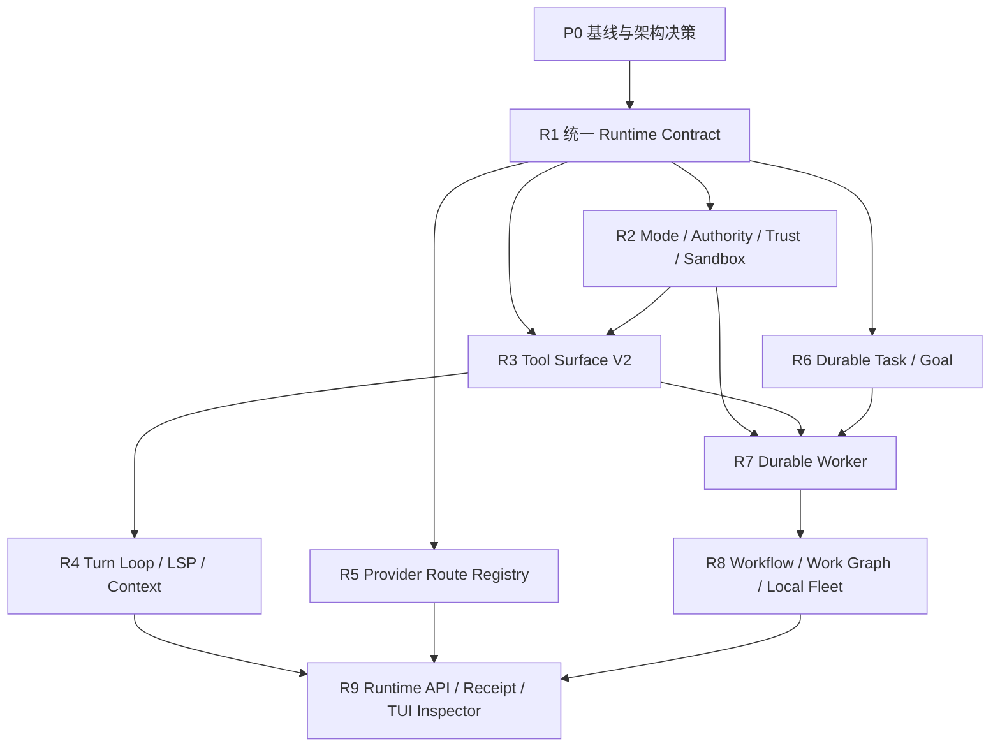

# CodeRook Spec-Driven 改造执行计划

> 依据：[specdriven.md](../specdriven.md)  
> 计划基线：`39fd86d39b7d39ff20cd963de7f094c40ca527f5`  
> 计划目标：把 R1-R9 转换为可按 PR 实施、可独立验证、可安全回滚的工程任务  
> 计划方式：不按日期承诺进度，以阶段门禁和验收证据推进

## 实施状态

| 单元 | 状态 | 验证基线 |
|---|---|---|
| P0 基线与关键决策 | 进行中 | 完整 CI 已建立；ADR 待补 |
| PR-01 Runtime models 与 SQLite store | 已完成 | 幂等 migration、连续 seq、原子写入和工具终态约束 |
| PR-02 Runtime service 与 session facade | 已完成 | 历史 session 幂等导入、真实 IPC 投影、`470 passed, 3 skipped` |
| PR-03 Event replay 与 boot recovery | 下一步 | 尚未开始 |

## 1. 改造结果

完成本计划后，CodeRook 应具备以下可验证能力：

1. TUI、CLI、headless 和 Worker 使用同一套 Thread/Turn/Item/Event 运行时记录。
2. daemon 重启后，能够恢复 thread、turn、task、worker、workflow 和事件游标。
3. Mode、Authority、Workspace Trust 与 Sandbox Capability 相互独立且可观察。
4. 模型默认只看到稳定、可裁剪、可延迟发现的工具目录。
5. Turn Loop 对断流、卡死、重复读取、超大输出和 LSP 诊断有明确边界。
6. 每个 turn 保存实际 Provider Route、token 使用、工具结果、审批和错误证据。
7. Task、Goal、Worker、Workflow 和本地 Fleet 均有持久状态与恢复语义。
8. HTTP/SSE、TUI Inspector 和 Turn Receipt 都从 durable records 投影，不读取私有内存状态。

以下内容不进入本轮主线：

- Web 和移动端。
- SSH/远程 Fleet。
- ACP、Zed、VS Code bridge。
- 语音、社交平台桥接和多语言 UI。
- 大量 Provider 厂商预设。
- 任意 Python/JavaScript Workflow 执行。

## 2. 实施原则

### 2.1 单一事实来源

- SQLite 保存实体状态、关系、事件序号和 schema version。
- JSONL/artifact 保存大正文，SQLite 只保存引用、hash、大小和预览。
- TUI、CLI 和 API 只通过 service 查询，不直接读写数据库或内部 registry。
- 现有 `session.*` 作为兼容 facade，不建立第二套运行时状态。

### 2.2 增量切换

- 先增加新模型和 store，再接入现有 session/run 路径。
- 每个阶段先完成写入和查询，再切换 UI。
- 旧协议在兼容期继续工作，但内部必须调用新 service。
- 不长期保留双写；历史 session 使用幂等导入或惰性迁移。

### 2.3 协议与测试先行

- 新命令和事件先加入 `core/bus` 的 Pydantic discriminated union。
- 修改 bus model 后立即生成并校验 `WIRE_PROTOCOL.md`。
- 每个 PR 都要有失败用例、正常用例和兼容用例。
- 涉及重启、断线或并发语义时，必须增加真实 daemon 集成测试。

### 2.4 控制模块规模

现有高风险汇合点：

| 文件 | 当前规模 | 改造策略 |
|---|---:|---|
| `src/code_rook/tui/app.py` | 约 1557 行 | 新增 panel/controller 模块，禁止继续集中堆叠 |
| `src/code_rook/core/session/store.py` | 约 625 行 | 保留 transcript 兼容能力，运行时状态迁入 runtime store |
| `src/code_rook/core/config.py` | 约 580 行 | Provider route 配置拆为独立模块 |
| `src/code_rook/core/subagent/tool.py` | 约 455 行 | 工具协议与 Worker service 分离 |
| `src/code_rook/core/app.py` | 约 433 行 | handler 逐步委托给领域 service |
| `src/code_rook/core/session/manager.py` | 约 421 行 | 收敛为 runtime/session facade |
| `src/code_rook/core/runner.py` | 约 397 行 | 工具装配迁入 catalog builder |
| `src/code_rook/core/loop.py` | 约 397 行 | watchdog、guard、LSP 分成独立组件 |

新增单模块超过 800 行时，应先评估领域拆分。

## 3. 依赖顺序



允许的并行关系：

- R2 的模型设计、R5 的 route store、R6 的 Task/Goal 模型可在 R1 store 稳定后并行。
- R4 必须等待 R3 invocation/capability 接口稳定。
- R7 必须等待 R2、R3、R6 的权限、工具和任务契约稳定。
- R8 必须等待 Durable Worker 通过重启恢复测试。
- R9 的接口设计可以提前，正式实现必须以 durable runtime 为数据源。

## 4. P0：基线冻结与关键决策

### 4.1 目标

在改造前冻结可比较基线，避免把既有故障误判为新架构回归。

### 4.2 工作项

1. 记录完整 CI 结果、测试数量和 wheel smoke 结果。
2. 为现有 session create/resume/fork/export/delete、event subscribe、run cancel 建立 characterization tests。
3. 确认并记录以下架构决策：

   - runtime 数据库路径和 schema version 策略。
   - 每 thread 单调 `seq` 的事务分配方式。
   - SQLite 与 JSONL/artifact 的事实边界。
   - 历史 session 的惰性导入与幂等标记。
   - daemon `boot_id` 与 interrupted recovery 规则。
   - runtime service 的同步/异步数据库访问策略，禁止阻塞 event loop。

4. 建立迁移测试 fixture，至少包含：

   - 空用户目录。
   - 现有 session 和 transcript。
   - 尾部损坏 transcript。
   - 未完成 tool call。
   - daemon 异常退出时的 running run。

### 4.3 退出条件

- 当前完整 CI gate 通过。
- 基线 fixture 可重复运行且不依赖真实 API key。
- 关键决策已写入 ADR 或计划附录，不在实现 PR 中临时决定。

## 5. R1：统一 Runtime Contract

### PR-01：Runtime models 与 SQLite store

建议新增：

- `src/code_rook/core/runtime/models.py`
- `src/code_rook/core/runtime/store.py`
- `src/code_rook/core/runtime/migrations.py`
- `tests/unit/test_runtime_models.py`
- `tests/unit/test_runtime_store.py`
- `tests/unit/test_runtime_migrations.py`

工作范围：

- 定义 ThreadRecord、TurnRecord、TurnItemRecord、RuntimeEventRecord。
- 建立 SQLite schema、schema version 和幂等 migration。
- 在同一事务内写入状态、item 和 event seq。
- 大 payload 先保留接口，不在本 PR 实现 artifact spill。

验收：

- 并发追加事件时 seq 唯一、单调且无缺口。
- migration 重复执行不改变结果。
- 非法状态转换和重复 terminal result 被拒绝。
- store unit test 不依赖 daemon。

### PR-02：Runtime service 与 session facade

建议新增或修改：

- `src/code_rook/core/runtime/service.py`
- `src/code_rook/core/session/manager.py`
- `src/code_rook/core/session/store.py`
- `src/code_rook/core/app.py`
- `tests/unit/test_runtime_service.py`
- `tests/integration/test_runtime_session_facade.py`

工作范围：

- 新增 thread/turn/item 查询和写入 service。
- 现有 `session.*` handler 改为调用 runtime service。
- 历史 session 惰性导入，导入标记必须幂等。
- 保持 create/resume/fork/export/delete 的现有外部行为。

验收：

- 现有 session 测试全部通过。
- 同一 session 不会在旧 manager 和 runtime service 中形成两份可变状态。
- 导入中断后可安全重试。
- 新创建会话可通过 thread 查询接口读取。

### PR-03：Event replay、boot recovery 与 tool pair invariant

建议新增或修改：

- `src/code_rook/core/runtime/recovery.py`
- `src/code_rook/core/events/writer.py`
- `src/code_rook/core/events/bus.py`
- `src/code_rook/core/bus/commands.py`
- `src/code_rook/core/bus/events.py`
- `tests/integration/test_event_replay.py`
- `tests/integration/test_runtime_recovery.py`

工作范围：

- 增加 `event.replay(after_seq)` 和 replay-to-live 切换。
- daemon 启动生成 `boot_id`。
- 将旧 boot 中的 running turn 标记为 interrupted。
- turn 终态前检查每个 tool call 恰好有一个 terminal result。

验收：

- 客户端在 seq N 断线后能补齐事件，无重复、无缺口。
- Core 在工具执行后、结果持久化前退出时，重启后产生可解释终态。
- `WIRE_PROTOCOL.md` 已重新生成且 `--check` 通过。

R1 阶段门禁：

- daemon 重启后可查询历史 thread、turn、item、event 和 terminal error。
- 所有 `session.*` 兼容测试通过。
- TUI 尚未改版，但继续可用。

## 6. R2：Mode、Authority、Trust 与 Sandbox

### PR-04：权限领域模型和收窄规则

建议新增或修改：

- `src/code_rook/core/authority/models.py`
- `src/code_rook/core/authority/evaluator.py`
- `src/code_rook/core/authority/sandbox.py`
- `src/code_rook/core/permissions/manager.py`
- `src/code_rook/core/tools/invocation.py`
- `tests/unit/test_authority_matrix.py`
- `tests/unit/test_sandbox_capability.py`

工作范围：

- 分离 RuntimeMode、AuthorityProfile、WorkspaceTrust、SandboxCapability。
- 定义 child authority 交集和 action capability 判定。
- Windows 明确报告无 OS sandbox。
- turn 启动时冻结有效权限快照。

验收：

- Plan 不可调用 mutation action 或任意 shell。
- Operate + Ask 的写操作仍需审批。
- child/profile/project config 不能提升 parent authority。
- 未知 capability 默认拒绝。

### PR-05：协议与 TUI 投影

建议新增或修改：

- `src/code_rook/core/bus/commands.py`
- `src/code_rook/core/bus/events.py`
- `src/code_rook/tui/app.py`
- `src/code_rook/tui/panels/runtime_status.py`
- `tests/unit/test_tui_runtime_status.py`
- `tests/integration/test_runtime_authority_flow.py`

工作范围：

- 增加 mode、authority、trust、sandbox 查询和下一 turn 设置命令。
- TUI header 展示四维状态。
- 实现 `/mode`、`/permissions`、`/trust`、`/sandbox`。
- 运行中 turn 不静默改变权限。

R2 阶段门禁：

- 权限矩阵测试覆盖 Plan/Act/Operate × Ask/Auto Review/Full Access。
- TUI 展示值与 TurnRecord 中冻结值一致。
- Windows 不出现虚假的 sandbox enabled 描述。

## 7. R3：Tool Surface V2

### PR-06：ToolSpec、Catalog 与稳定 schema

建议新增或修改：

- `src/code_rook/core/tools/spec.py`
- `src/code_rook/core/tools/catalog.py`
- `src/code_rook/core/tools/registry.py`
- `src/code_rook/core/runner.py`
- `tests/unit/test_tool_catalog.py`

工作范围：

- 定义 ToolSpec、action、capability、approval、parallel policy、output policy。
- canonicalize schema 并按稳定顺序生成 catalog。
- catalog 仅在注册变化时失效。
- 权限按 action 裁剪。

验收：

- 相同配置生成 byte-for-byte 相同的 canonical catalog。
- Plan 可见 `File.read`，不可见 `File.write/edit/patch`。
- 未声明 capability、未知 action 和 caller 不匹配时 fail closed。

### PR-07：Action-family adapter

建议新增：

- `src/code_rook/core/tools/families/file.py`
- `src/code_rook/core/tools/families/git.py`
- `src/code_rook/core/tools/families/run.py`
- `src/code_rook/core/tools/families/bash.py`
- `tests/unit/test_tool_family_adapters.py`

工作范围：

- 先迁移 File、Git、Run，再迁移 Bash lifecycle。
- 旧工具实现继续作为 adapter 后端，不立即重写。
- 旧工具名仅用于 transcript replay 和内部兼容。
- resource claims 接入并行调度。

验收：

- 旧 transcript 可 replay。
- 模型 catalog 不再出现旧平铺工具名。
- 同路径写 claim 自动串行或拒绝，不并发写入。

### PR-08：Deferred tools 与 Artifact store

建议新增或修改：

- `src/code_rook/core/tools/discovery.py`
- `src/code_rook/core/artifacts/store.py`
- `src/code_rook/core/mcp/tool.py`
- `tests/unit/test_tool_discovery.py`
- `tests/unit/test_artifact_store.py`

工作范围：

- 实现确定性 `tool_search`。
- MCP 工具默认 deferred。
- 大输出写入 `.coderook/artifacts/<sha256>`。
- 增加 artifact.read 和有界 preview。

验收：

- deferred tool 激活不改变 active head hash。
- artifact hash、大小和读取范围可验证。
- artifact 丢失或 hash 不一致时返回结构化错误。
- 超大 MCP 输出不会直接进入 prompt 或 event。

R3 阶段门禁：

- 默认模型可见工具数量有明确上限。
- schema 稳定性、action 权限和大输出边界测试通过。
- runner 不再负责逐个硬编码所有工具装配细节。

## 8. R4：Turn Loop Reliability、LSP 与 Context

### PR-09：Watchdog 与重复行为防护

建议新增或修改：

- `src/code_rook/core/turn/watchdog.py`
- `src/code_rook/core/turn/stuck_guard.py`
- `src/code_rook/core/turn/read_guard.py`
- `src/code_rook/core/loop.py`
- `tests/unit/test_stream_watchdog.py`
- `tests/unit/test_stuck_guard.py`

工作范围：

- stream idle timeout、wall timeout、max response bytes。
- transient retry 与 no-content retry 分开统计。
- stuck/read-repeat/coalesce 机制。
- 工具执行前后检查 cancellation。

验收：

- 永不结束的 stream 在边界内进入明确 failed 状态。
- 相同参数和结果重复达到阈值时产生 stuck event。
- 取消后不再启动新工具。

### PR-10：LSP V1、working set 与 prefix fingerprint

建议新增或修改：

- `src/code_rook/core/lsp/client.py`
- `src/code_rook/core/lsp/diagnostics.py`
- `src/code_rook/core/context.py`
- `src/code_rook/core/loop.py`
- `tests/unit/test_lsp_diagnostics.py`
- `tests/unit/test_working_set.py`
- `tests/unit/test_prefix_fingerprint.py`

工作范围：

- 自动探测 pyright/basedpyright。
- 修改后获取有界 diagnostics，默认仅 error。
- diagnostics 作为 transient context。
- 记录 working set 和不含敏感正文的 prefix fingerprint。
- 保留现有 CompactionSummary、recent window 和 memory 实现。

R4 阶段门禁：

- LSP 缺失、失败、超时和超大输出均可降级。
- compaction 既有质量门禁不回归。
- prefix 变化能指出来源，但不记录 prompt 正文。

## 9. R5：Provider Route Registry 与 Doctor

### PR-11：Route store、适配器与诊断

建议新增或修改：

- `src/code_rook/core/llm/routes.py`
- `src/code_rook/core/llm/route_store.py`
- `src/code_rook/core/llm/factory.py`
- `src/code_rook/core/llm/credentials.py`
- `src/code_rook/cli/commands/provider.py`
- `src/code_rook/cli/commands/doctor.py`
- `tests/unit/test_provider_routes.py`
- `tests/integration/test_provider_doctor.py`

工作范围：

- Provider、wire format、model、base URL、credential ref 分离。
- 支持 anthropic、openai、两类 compatible 和 opencode-zen preset。
- 项目配置禁止设置 active provider、base URL 和 credential。
- TurnRecord 保存实际 RouteReceipt。
- doctor 分类报告 credential、TLS、401、schema 和 model error。

验收：

- 切换 route 不覆盖其他 route 的凭据。
- 非 loopback HTTP 默认拒绝。
- doctor、event、日志和异常中无 key 正文。
- route 选择不依赖模型名前缀的隐式切换。

M1「可靠单 Agent」完成门禁：

- R1-R5 全部阶段门禁通过。
- 单个 turn 在断线、重启、超时和模型错误后仍可解释。
- TUI 可观察 mode、authority、route、trust、sandbox 和 terminal error。

## 10. R6：Durable Task、Goal、Hooks 与 Skills

### PR-12：Task/Goal store 与 timeline

建议新增或修改：

- `src/code_rook/core/task/models.py`
- `src/code_rook/core/task/store.py`
- `src/code_rook/core/task/service.py`
- `src/code_rook/core/goal/models.py`
- `src/code_rook/core/goal/service.py`
- `tests/unit/test_task_store.py`
- `tests/unit/test_goal_service.py`

工作范围：

- 迁移现有简单 Task，增加 attempt、acceptance、gate、artifact、timeline。
- Goal 与 Task、Plan 明确分离。
- dependency 未满足时禁止 claim。
- 所有状态变化写入 runtime event。

### PR-13：Hooks V2 与 Skills provenance

建议新增或修改：

- `src/code_rook/core/hooks/models.py`
- `src/code_rook/core/hooks/runner.py`
- `src/code_rook/core/skills/manifest.py`
- `src/code_rook/core/skills/manager.py`
- `tests/unit/test_hook_runner.py`
- `tests/unit/test_skill_provenance.py`

工作范围：

- hook payload 版本化、有界、脱敏。
- timeout 时终止进程树。
- blocking hook 明确 fail-open/fail-closed。
- skill 增加 digest、source、installed_at、trust 和 audit。

R6 阶段门禁：

- daemon 重启后 task timeline、attempt、artifact 和 goal evidence 可查询。
- Hook 卡死、超大输出和 secret 注入测试通过。
- Skill digest mismatch 在执行前可见。

## 11. R7：Durable Worker

### PR-14：Worker ledger 与统一 agent actions

建议新增或修改：

- `src/code_rook/core/workers/models.py`
- `src/code_rook/core/workers/store.py`
- `src/code_rook/core/workers/service.py`
- `src/code_rook/core/subagent/tool.py`
- `tests/unit/test_worker_store.py`
- `tests/integration/test_worker_lifecycle.py`

工作范围：

- 实现 start/status/peek/wait/cancel/followup。
- 前台短调用仍可使用轻量路径，后台任务必须写入 WorkerRecord。
- 保存 parent turn、goal、profile、route、authority、预算和 evidence。

### PR-15：Write claims、预算与恢复

建议新增或修改：

- `src/code_rook/core/workers/claims.py`
- `src/code_rook/core/workers/lease.py`
- `src/code_rook/core/workers/recovery.py`
- `src/code_rook/tui/panels/workers.py`
- `tests/unit/test_write_claims.py`
- `tests/integration/test_worker_recovery.py`

工作范围：

- write claim 在 worker 启动前 fail closed。
- 根 goal token budget 由所有 descendant 共享。
- heartbeat、lease、retry 和 interrupted recovery。
- parent 只接收结构化摘要和 bounded events。

M2「可靠多 Agent」完成门禁：

- daemon 重启后 worker 可查询、resume 或 retry。
- 写范围冲突在修改发生前被拒绝。
- child 不能提升 parent authority。
- budget 用尽时所有 descendant 有一致终态。

## 12. R8：Workflow、Work Graph 与本地 Fleet

### PR-16：Workflow IR 与 Work Graph reducer

建议新增：

- `src/code_rook/core/workflow/models.py`
- `src/code_rook/core/workflow/parser.py`
- `src/code_rook/core/workflow/executor.py`
- `src/code_rook/core/workflow/reducer.py`
- `tests/unit/test_workflow_ir.py`
- `tests/integration/test_workflow_recovery.py`

工作范围：

- V1 仅支持 sequence、parallel、branch、retry、review_gate、fan_in。
- 配置使用 TOML/JSON，不执行任意脚本。
- Work Graph 状态由 durable event reducer 生成。
- gate 失败阻止下游运行。

### PR-17：Local Fleet ledger

建议新增或修改：

- `src/code_rook/core/fleet/ledger.py`
- `src/code_rook/core/fleet/scheduler.py`
- `src/code_rook/core/fleet/local_host.py`
- `src/code_rook/tui/panels/workflow.py`
- `tests/integration/test_local_fleet.py`

工作范围：

- 仅支持本地进程 host adapter。
- 复用 Worker lease、heartbeat、retry、resume 和 write claims。
- 并发、token、节点数、深度和 wall-time 全部有界。

M3「可编排 Agent」完成门禁：

- Core 中断后 workflow 不重复执行已完成节点。
- parallel 遵守 concurrency 和 write claims。
- fan-in 引用每个 child evidence。
- 相同输入与固定 route/profile 可生成可比较 receipt。

## 13. R9：Runtime API、Receipt 与 TUI Inspector

### PR-18：HTTP/SSE 与 Turn Receipt

建议新增：

- `src/code_rook/core/api/app.py`
- `src/code_rook/core/api/auth.py`
- `src/code_rook/core/receipts/builder.py`
- `tests/integration/test_runtime_http_api.py`
- `tests/unit/test_turn_receipt.py`

工作范围：

- API 只调用 runtime service。
- 默认仅绑定 `127.0.0.1`。
- 非 loopback 必须 bearer token。
- SSE 使用与内部 event replay 相同的 seq/cursor。
- Receipt 由 durable records 纯函数生成。

验收：

- SSE 重连无重复、无缺口。
- API 与内部协议查询同一 turn 得到一致状态。
- cost 未知时明确输出 `unknown`。
- 无 token 的非 loopback bind 启动失败。

### PR-19：TUI Inspector 与投影拆分

建议新增或修改：

- `src/code_rook/tui/panels/tasks.py`
- `src/code_rook/tui/panels/workers.py`
- `src/code_rook/tui/panels/workflow.py`
- `src/code_rook/tui/panels/turn_inspector.py`
- `src/code_rook/tui/controllers/runtime.py`
- `src/code_rook/tui/app.py`
- `tests/unit/test_tui_turn_inspector.py`

工作范围：

- 主 transcript 保持简洁。
- 增加 Tasks/Workers/Workflow 与 Turn Inspector。
- `/context` 展示 token、working set、memory、summary 和 tool schema 开销。
- 所有 panel 从 runtime query/event projection 获取状态。

M4「可集成运行时」完成门禁：

- TUI 退出不影响 durable worker。
- TUI、API 和 CLI 对同一 turn 的状态、usage 和 receipt 一致。
- TUI 不读取 runtime service 私有字典或 registry。

## 14. 每个 PR 的强制工作流

1. 先写或更新 acceptance contract。
2. 增加能失败的单元或集成测试。
3. 实现最小范围改动。
4. 运行该领域的定向测试。
5. 运行完整 CI gate。
6. 检查 `git status --short` 和 staged diff。
7. bus model 变化时，生成并提交 `WIRE_PROTOCOL.md`。
8. PR 描述必须包含：

   - 改动范围。
   - 明确不做的内容。
   - 数据迁移或兼容行为。
   - 测试证据。
   - 回滚方式。
   - 已知风险。

完整 CI gate：

```powershell
uv run ruff check .
uv run python scripts/check_brand.py
uv run mypy src
uv run mypy --platform linux src
uv run pytest -q
uv run python scripts/gen_protocol_doc.py --check
uv build
uv run python scripts/smoke_wheel.py dist
```

## 15. 跨阶段故障注入矩阵

| 故障 | 首次引入阶段 | 必须观察到的结果 |
|---|---|---|
| Provider 在半个 tool call 后断流 | R4 | turn 分类失败或重试，不生成孤立 terminal result |
| Tool 执行后、result 持久化前 Core 退出 | R1 | 重启后 turn 为 interrupted，缺口可解释 |
| SQLite transaction 中断 | R1 | 不出现半条状态和重复 seq |
| Event client 在 seq N 后断线 | R1 | replay + live 无重复、无缺口 |
| 权限配置试图提升 parent authority | R2 | fail closed 并记录原因 |
| Artifact 丢失或 hash 不匹配 | R3 | 返回结构化 unavailable/corrupt |
| LSP 不存在、超时或输出过大 | R4 | 有界降级，不阻塞 turn |
| Hook 卡死或输出 secret | R6 | 超时终止、脱敏并记录 event |
| Worker heartbeat 停止 | R7 | lease 到期，状态可恢复或重试 |
| Worktree 存在未提交修改 | R7/R8 | 合并或删除前阻止破坏性操作 |
| Workflow 执行一半 Core 退出 | R8 | 重启后从 ledger 恢复，不重复完成节点 |
| SSE 客户端断线重连 | R9 | cursor 续传一致 |

## 16. 主要风险与控制措施

| 风险 | 影响 | 控制措施 |
|---|---|---|
| 新旧 session/runtime 双重事实来源 | 状态分叉、恢复错误 | session 只做 facade；迁移后 SQLite 为状态事实来源 |
| SQLite 同步 I/O 阻塞 event loop | TUI 卡顿、stream timeout | 明确异步访问策略并增加延迟测试 |
| 大规模工具改名破坏历史 transcript | 旧会话无法恢复 | 旧名只保留 replay alias，先加 adapter 再隐藏 |
| Authority 组合出现隐式提权 | 安全边界失效 | 使用交集模型、表驱动矩阵、未知项 fail closed |
| Event replay 与 live 交界丢事件 | UI 状态不一致 | 同一 seq 源、明确切换水位、集成断线测试 |
| TUI 继续膨胀为单体 | 后续不可维护 | panel/controller 拆分，UI 仅做投影 |
| Durable Worker 自动重试失控 | 重复写入、成本失控 | 最大重试、backoff、共享预算、write claim |
| 一次 PR 跨多个阶段 | 难审查、难回滚 | 以本计划 PR 边界为上限，跨阶段内容拆分 |

## 17. 总体验收

只有同时满足以下条件，才认为主线改造完成：

1. M1-M4 所有阶段门禁均有自动化测试证据。
2. 所有旧 `session.*` 用户流程仍可运行。
3. 任意 turn 可在 daemon 重启后解释 route、权限、工具、usage、产物和终止原因。
4. 每个 tool call 恰好对应一个 terminal result。
5. Worker、Workflow 和 Fleet 的恢复不会重复已完成写操作。
6. TUI、CLI、HTTP API 对同一 durable state 的投影一致。
7. Windows 对 sandbox 能力的描述真实。
8. 密钥不出现在项目配置、日志、event、receipt 或错误正文。
9. 完整 CI gate 持续通过。
10. R10 延后能力没有提前侵入主线。
