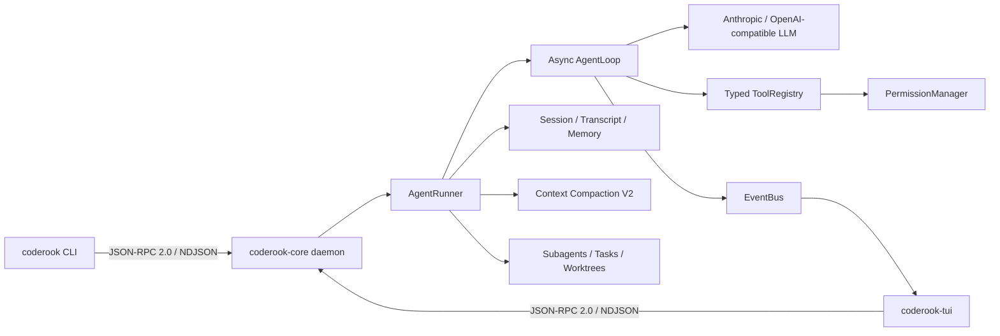

# CodeRook 系统使用说明与功能详解

> 本文档基于 CodeRook 当前代码库编写，系统梳理整体架构、功能清单与完整使用方式，
> 作为日常使用和二次开发的参考。快速上手可直接跳到「第 3 章 快速开始」。

---

## 1. 系统概述

CodeRook 是一个使用 **Python 3.12** 构建的**本地 AI 编程 Agent 运行时**。它不是一次性调用
大模型的聊天 Demo，而是一个完整可观测、可恢复、受权限约束的执行工程系统，核心覆盖：类型化
协议、异步运行时、工具安全、上下文治理、任务隔离与故障恢复。

### 1.1 双进程架构

CodeRook 采用 **daemon + client** 的双进程模型：

```
coderook-core (常驻守护进程)
   └─ 监听 127.0.0.1:7437 (TCP)   ← JSON-RPC 2.0 / NDJSON
        ↑
   ┌────┴─────┐
coderook CLI   coderook-tui (Textual 终端界面)
```

- **`coderook-core`**：常驻后台进程，持有 Agent、会话、后台任务、权限与运行时状态。
- **`coderook`**：命令行客户端，适合脚本、调试与无人值守任务。
- **`coderook-tui`**：主要交互界面，基于 Textual 构建的终端 UI。

`coderook-tui` 是**主前端**。所有用户可见的任务管理、可观测性与交互都以 TUI 为首要实现与
验证目标；CLI 仅用于快速脚本测试与调试，不是产品界面。前端退出不会改变协议边界，未来可在
同一 IPC 之上增加 Web 或 IDE 客户端。

### 1.2 运行时链路



---

## 2. 功能清单（详细）

### 2.1 Agent 执行循环

- **异步 Plan-Act-Observe 循环**：模型决策、工具调用、观察结果持续迭代，直到完成任务。
- **只读工具批量并行**：只读操作可并行执行，提升效率。
- **Todo 软状态机**：任务状态跟踪与动态调整。
- **限流退避与上下文溢出恢复**：模型限流时自动退避，上下文接近上限时自动处理。
- **steering 实时纠偏**：任务运行中可通过输入补充要求，在下一次模型决策前生效。

### 2.2 类型化协议（总线层）

- **Pydantic v2 命令/事件模型**：所有 IPC 消息为类型化模型，在 `type` 字段上做判别联合。
- **JSON-RPC 2.0 + NDJSON 流**：行分隔的 JSON 流式传输。
- **自动生成协议文档**：`WIRE_PROTOCOL.md` 由 `scripts/gen_protocol_doc.py` 自动生成。

### 2.3 本地安全与权限

- **loopback 限制**：只接受本机连接。
- **首帧 token 认证**：`~/.coderook/ipc-token` 随机凭据，常量时间比较。
- **工作区边界**：工具统一使用 `WorkspaceBoundary`，拒绝绝对路径逃逸与 `..`。
- **参数校验**：工具输入经校验。
- **交互审批与 headless 权限模式**：TUI 内交互式审批；CLI 支持 `fail-fast` / `deny` /
  `allow-list` 三种无人值守策略。
- **权限姿态（Authority）**：`ask`（询问后修改）/ `auto-review`（自动接受修改）/
  `full-access`（全自动执行）。
- **工作区信任（Trust）**：项目是否受信任的独立状态；Linux bwrap/macOS Seatbelt 可实际包装
  AUTO_REVIEW 下的 Bash，Windows 无后端时明确降级并回到审批链。

### 2.4 代码工具（action-family）

- **File**：`read_file`（返回 SHA-256）、`write_file`、`edit_file`（唯一/批量精确替换、
  冲突检测、原子落盘、有界 unified diff）、`apply_patch`（多文件事务补丁，dry-run）。
- **Git**：`git_diff`（只读子进程返回 staged/unstaged/untracked、rename、numstat）。
- **Run / Bash**：执行命令；`Bash.run` 支持默认 isolated 与按 session 复用 cwd/env/venv 的
  persistent 模式，保留进程树管理与取消清理。
- **检索**：`glob`（工作区边界、ignore 规则、稳定排序）、`grep`（跳过二进制与超大文件）。
- **Web / 图片 / 诊断**：`web_fetch`/`web_search` 多后端降级；`read_image` 或在 TUI 粘贴
  本地图片路径会先落 ArtifactStore，只向下一次模型请求交付，永久账本不存 base64；编辑后
  并发运行可取消、去重的 pyright/tsc 诊断。
- **Checkpoint / Rewind**：写前持久化 preimage 与 post-hash，支持冲突预检和多文件回滚。
- **工具重试语义**：显式声明 `NEVER` / `RATE_LIMIT` / `IDEMPOTENT`。

### 2.5 会话系统

- **多轮 thread**：会话多轮对话。
- **block 级 transcript**：消息按 block 持久化。
- **崩溃尾部恢复**：冷启动扫描 `meta.json`，未完成会话恢复为 `interrupted`。
- **完整生命周期**：创建 / 恢复 / 分叉（fork，保留 lineage）/ 导出（markdown/json）/
  删除（原子 tombstone）。
- **增量状态**：user message、run ID、active 状态在执行前落盘。

### 2.6 长期记忆

- 项目级 JSON 记录，写入 `.coderook/memory/`。
- Markdown 索引、来源追踪、敏感信息脱敏。
- 中英文词法检索（确定性打分，不依赖向量库）。

### 2.7 上下文治理（压缩 V2）

- **80% 自动压缩阈值**、最近窗口保留（约 25%）。
- 结构化摘要：模型生成目标、完成项、约束、决策、文件、TODO、错误、关键数据的 JSON 摘要。
- 质量门禁：Pydantic 校验结构，检查约束/TODO/错误/文件路径是否丢失。
- 工具输出分级：小型原文保留、中型保留头尾、超大由 LLM 蒸馏。
- 增量压缩：后续压缩合并上一版摘要，不重复处理完整 transcript。

### 2.8 多 Agent 协作

- **角色模型覆盖**：内置 executor / planner / reviewer 三种 agent profile。
- **只读 reviewer**：评审阶段不修改代码。
- **共享任务板**：`task_claim` 原子认领任务。
- **跨 turn 后台任务**：daemon 级注册表持有，可跨对话轮次查询和取消。
- **Git worktree 隔离**：并行子 Agent 的修改限制在 `.coderook/worktrees/`。
- **Durable Worker**：统一的 `agent` 工具，支持 `start/status/peek/wait/cancel/followup`；
  写入型 Worker 必须声明 `exact_files` / `write_roots` / `coordination_contract`。

### 2.9 扩展机制

- **Skills**：带 provenance 和 digest 校验的可复用技能，支持
  `list/show/install/remove/audit`。
- **MCP 工具接入**：MCP server 管理。
- **异步 Hooks**：`session_start` / `message_submit` / `turn_start` / `tool_call_before` /
  `tool_call_after` / `approval_requested` / `compaction_completed` / `worker_started` /
  `worker_finished` / `turn_stop` / `session_stop`。

### 2.10 Workflow 与本地 Fleet

- **Workflow**：严格 TOML/JSON 数据描述 `sequence` / `parallel` / `branch` / `retry` /
  `review_gate` / `fan_in`，不执行配置内的代码；有节点数、深度、并发、token 与 wall-time
  上限；Core 重启从 ledger 恢复中断节点。
- **本地 Fleet**：跨进程 Worker 调度。

### 2.11 可观测性

- **TUI 实时事件**：流式响应、工具折叠块、权限审批、上下文水位、后台任务事件。
- **Token 水位**：上下文占用监控。
- **Trace**：`events.jsonl` 与脱敏 Trace，支持 `--layer` 过滤。
- **Turn Receipt**：可离线重建的每次 turn 证据（route/model/mode/usage/cost/工具/审批）。
- **Runtime API**：本地 HTTP/JSON 与 SSE 接口（默认 `127.0.0.1:7438`）。

---

## 3. 快速开始

### 3.1 环境要求

- Python `3.12`
- [uv](https://docs.astral.sh/uv/)
- Git

### 3.2 安装依赖

```powershell
git clone https://github.com/kyletser/coderook.git
cd coderook
uv sync
Copy-Item .env.example .env
```

macOS/Linux：

```bash
cp .env.example .env
```

Windows 安装与自带解释器的 portable ZIP 分别使用 `scripts\install-windows.ps1`、
`scripts\build_windows_portable.ps1`。容器入口为 `Dockerfile` 和 `docker-compose.example.yml`。

### 3.3 配置模型

推荐使用交互式向导：

```powershell
uv run coderook configure
```

向导支持 Anthropic-compatible 与 OpenAI-compatible 接入，隐藏输入 API key，为两种协议分别
保留 key。候选 route 先通过 ProviderDoctor，再原子提交并重启 CodeRook 管理的 Core；诊断失败
不会覆盖旧活动配置。普通配置保存在 `~/.coderook/config.toml`，
密钥单独保存在 `~/.coderook/credentials.json`，不会写入仓库或日志。

查看当前配置（不显示密钥正文）：

```powershell
uv run coderook config-status
```

### 3.4 启动

```powershell
uv run coderook
```

无参数 `coderook` 会进入 TUI，自动复用已有 Core；若 Core 未运行，则在后台启动并等待认证
就绪。首次没有 LLM 配置时会先进入 API 配置向导。

---

## 4. 日常使用（TUI）

### 4.1 发送消息

在底部输入框描述目标，例如：

```text
检查当前项目的登录逻辑，先说明问题，再修复并运行相关测试。
```

### 4.2 输入快捷键

| 操作 | 快捷键 |
|---|---|
| 发送消息或执行完整斜杠命令 | `Enter` |
| 输入换行 | `Shift+Enter`、`Alt+Enter`、`Ctrl+J`；macOS 也可用 `Cmd+Enter` |
| 打开斜杠命令补全 | 输入 `/` |
| 在补全列表中移动 | `↑` / `↓` |
| 补全当前命令 | `Tab` |
| 关闭补全列表 | `Esc` |
| 退出 TUI | `Ctrl+Q` |

### 4.3 Agent 运行时补充要求

任务运行期间输入框仍可用，直接输入补充要求并按 `Enter` 会作为实时纠偏信息送入当前任务。
如果尚未选择文本，`Ctrl+C` 取消当前任务。

### 4.4 查看工具执行与回答问题

- 每一轮连续工具调用合并为动作摘要分组，成功项用绿色勾标识。
- 点击「深度思考」或工具动作摘要可折叠；点击单个工具可查看完整输入、结果、状态与耗时。
- Agent 提问时显示选项面板：`↑`/`↓` 或 `j`/`k` 移动；单选 `Enter` 确认；多选 `Space`
  勾选再 `Enter`；选择「输入自定义答案」或按 `Esc` 可自由回答。

### 4.5 复制输出

1. 鼠标拖选输出后按 `Ctrl+C`；
2. `Ctrl+Shift+C`：有选区复制选区，否则复制上一条完整回复；
3. `/copy`：复制上一条完整回复。

---

## 5. 斜杠命令（TUI）

输入 `/` 会列出内置命令与已注册 Skills。

| 命令 | 作用 |
|---|---|
| `/help` | 查看键位、内置命令及参数提示 |
| `/new` | 创建并切换到新会话 |
| `/sessions` | 打开历史会话选择器 |
| `/rename 标题` | 重命名当前会话 |
| `/fork [标题]` | 从当前会话创建分支 |
| `/export [md\|json]` | 导出当前会话 |
| `/delete --yes` | 删除当前会话 |
| `/model` | 查看或切换当前模型 |
| `/model <模型 ID>` | 直接切换到指定模型 |
| `/model add <模型 ID>` | 新增自定义模型并立即切换 |
| `/config` | 更换 API 平台、Key 或模型 |
| `/compact` | 手动压缩当前会话上下文 |
| `/copy` | 复制上一条完整回复 |
| `/plan` | 让下一条消息使用 Plan Mode |
| `/plan 任务描述` | 立即执行一次只读规划 |
| `/mode plan\|act\|operate` | 查看或切换工作模式 |
| `/permissions` | 查看或修改权限模式 |
| `/trust status\|grant\|revoke` | 查看或修改工作区信任状态 |
| `/sandbox status` | 查看真实 OS 隔离能力 |
| `/tasks` | 查看最近一次运行的任务状态 |
| `/workers` | 查看普通 Worker 与本地 Fleet Worker |
| `/workflow` | 列出 durable workflow |
| `/workflow start 文件` | 从 TOML/JSON IR 启动 workflow |
| `/workflow ID` | 展开 reducer 生成的 Work Graph |
| `/diff` | 查看当前工作区改动和统一 diff |
| `/rewind` | 从安全 checkpoint 恢复文件 |
| `/context` | 查看消息数、token 估算、运行次数和上下文占用 |
| `/cost` | 查看本会话成本分解与缓存节省 |
| `/turn` | 检视当前最近 turn 的 route、usage、工具、审批、诊断与 receipt |
| `/turn ID` | 检视指定 durable turn |
| `/skills` | 列出、查看、安装、删除或审计 Skills |
| `/mcp` | 查看 MCP server 状态和工具 |
| `/hooks [rerun ID --yes]` | 查看 Hook 或确认后重跑指定记录 |
| `/memory [delete ID --yes]` | 查看或确认后删除项目记忆 |
| `/jobs [show\|cancel]` | 查看或取消后台任务和 Worker |
| `/技能名` | 调用已注册的 Skill |

---

## 6. 工作模式与权限

Mode 决定**怎么工作**，Authority 决定**工具是否需要批准**，两者独立。

### 6.1 工作模式（Mode）

使用 `Tab` 在 `act → operate → plan` 间循环，或输入 `/mode plan|act|operate`：

- `Plan`：只读分析；
- `Act`：当前会话直接工作；
- `Operate`：权限上限与 Act 相同，适合交给耐久 Worker。

### 6.2 权限姿态（Authority）

`Shift+Tab` 在三种姿态间循环，或输入 `/permissions`：

| 模式 | 行为 |
|---|---|
| 询问后修改（ask） | 文件修改、命令和外部操作按安全策略请求确认 |
| 自动接受修改（auto-review） | 工作区内文件修改自动执行；命令和外部操作仍按策略确认 |
| 全自动执行（full-access） | 本机命令、修改和外部操作自动批准；Plan Mode 与工具边界仍生效 |

选择写入 `~/.coderook/policy.toml`，后续会话与重启后继续生效。

### 6.3 工具审批

需要确认时面板显示工具名称与命令/文件/任务内容，可选：

| 选择 | 快捷键 | 作用 |
|---|---|---|
| Allow once | `1` 或 `y` | 只允许这一次 |
| Always allow | `2` 或 `a` | 始终允许并记住后续会话 |
| Deny | `3` 或 `n` | 拒绝这一次 |
| Always deny | `4` 或 `d` | 拒绝并记住后续会话 |

`Esc` 等同拒绝这一次。永久规则保存在 `~/.coderook/policy.toml`。

### 6.4 Plan Mode

```text
/plan                # 让下一条消息进入 Plan Mode
/plan 分析认证模块的改造方案   # 直接规划一个任务
```

规划阶段只开放只读能力，Core 拒绝写文件、执行命令等越权操作。计划生成后可批准并实施 /
继续规划 / 取消。

### 6.5 Durable Worker

`agent` 工具支持 `start / status / peek / wait / cancel / followup`。后台 Worker 记录保存在
`~/.coderook/workers/`，daemon 重启后仍可查询。写入型 Worker 必须声明
`exact_files` / `write_roots` / `coordination_contract`；同一工作区相交声明直接拒绝。

### 6.6 Workflow

```text
/workflow start path/to/release.toml
/workflow
/workflow release-workflow
```

Workflow、节点事件与 receipt 保存于 `~/.coderook/workflow.db`，本地 Fleet Worker 保存在
`~/.coderook/fleet.db`。

---

## 7. 会话管理

### 7.1 TUI 内恢复

```text
/sessions
```

选择历史会话后按 `Enter` 恢复。

### 7.2 命令行会话管理

```powershell
uv run coderook sessions --all
uv run coderook chat --resume SESSION_ID
uv run coderook session rename SESSION_ID "新标题"
uv run coderook session fork SESSION_ID --title "实验分支"
uv run coderook session export SESSION_ID --format markdown -o session.md
uv run coderook session delete SESSION_ID --yes
```

`delete --yes` 永久删除，执行前请确认 ID。

### 7.3 恢复文件

`/rewind` 列出可用 checkpoint，选择后只恢复该 checkpoint 管理的文件；若文件之后又被其他
操作修改，恢复会拒绝覆盖。

---

## 8. Skills 管理

TUI 与 CLI 等价：

```powershell
uv run coderook skills list
uv run coderook skills show review
uv run coderook skills install "C:\path\to\my-skill" --trust --yes
uv run coderook skills audit
uv run coderook skills remove my-skill --yes
```

- 第一次 `install` 只预览（名称、路径、文件清单、trust、digest），确认后追加 `--yes`。
- `--scope user` 改为用户级安装；`.claude/skills`、`.codex/skills`、`.agents/skills`
  只做只读兼容导入。
- 受管 Skill 记录 source、installed_at、trust 与 SHA-256；文件被修改后 `audit` 显示
  `mismatch`，正文进入模型前会被拒绝执行。

---

## 9. CLI 命令（脚本与无人值守）

### 9.1 基础命令

```powershell
uv run coderook ping                     # 连通性测试 → pong
uv run coderook --version                # 版本号
uv run coderook configure                # 交互式 LLM 配置
uv run coderook config-status            # 查看生效配置
uv run coderook doctor [route_id]        # 诊断 provider 路由（--json 输出）
uv run coderook doctor all --json        # 系统、端口、sandbox、磁盘、runtime 汇总
uv run coderook doctor runtime --json    # 检查 ledger/SQLite 投影一致性
uv run coderook doctor bundle --output diagnostics.zip --yes  # 确认导出脱敏包
uv run coderook artifacts list --json    # 列出内容寻址产物
uv run coderook artifacts gc --days 30   # 安全预览；加 --yes 才删除
uv run coderook cancel RUN_ID            # 取消活动 run
```

### 9.2 Provider 路由管理

```powershell
uv run coderook provider list
uv run coderook provider add my-route --preset openai-compatible --base-url https://... --model deepseek-v4-pro
uv run coderook provider edit my-route --model new-model
uv run coderook provider remove my-route --delete-credential
uv run coderook provider use my-route
uv run coderook provider test [route_id]
uv run coderook model list [--route route_id]
```

预设可选：`anthropic`、`openai`、`openai-compatible`、`anthropic-compatible`、`opencode-zen`；
wire format 可选 `openai_chat`、`openai_responses`、`anthropic_messages`。

### 9.3 无人值守运行

```powershell
uv run coderook run --goal "分析项目并运行测试"
uv run coderook run --goal "分析项目" --output-format stream-json
uv run coderook run --goal "继续处理" --resume SESSION_ID
```

`--output-format` 支持 `text|json|stream-json`。机器格式的 stdout 不混入日志；
`--event-filter` 可筛选事件，`--include-partial` 可显式包含部分 token 事件。

Headless 任务默认 `fail-fast`（遇到需人工审批的工具立即退出，权限所需退出码为 3）。指定
允许工具时：

```powershell
uv run coderook run --goal "修改并验证代码" `
  --permission-mode allow-list `
  --allow-tool edit_file `
  --allow-tool apply_patch `
  --allow-tool Bash.run
```

macOS/Linux 将 PowerShell 续行符 `` ` `` 换成 `\`。`allow-list` 仍不能绕过危险命令规则和
工作区边界；完全不允许审批类工具时用 `--permission-mode deny`。

模型提问也必须是有限策略：默认 `--question-mode fail-fast`；`timeout` 需要同时传
`--question-timeout SECONDS`；`preset` 需要一个或多个按顺序消费的 `--answer TEXT`。

### 9.4 Trace 与诊断

```powershell
uv run coderook trace --follow
uv run coderook trace RUN_ID
uv run coderook trace RUN_ID --layer llm
```

`--layer` 可选 `ipc` / `event` / `llm`；`--direction` 过滤方向；`--raw` 输出原始 NDJSON。
Trace 默认不记录完整 LLM 正文，并对敏感信息脱敏。

---

## 10. Core 管理

正常使用不需要手动管理 Core。以下用于开发与排障：

```powershell
uv run coderook core status
uv run coderook core start
uv run coderook core restart
uv run coderook core stop
```

默认监听 `127.0.0.1:7437`，只接受本机连接，用 `~/.coderook/ipc-token` 认证客户端。

需要前台运行 Core 时（便于查看启动错误，日常不推荐）：

```powershell
uv run coderook-core
uv run coderook-tui --no-auto-core
```

---

## 11. 配置与本地数据

### 11.1 配置优先级

由低到高：

```text
内置默认值
→ ~/.coderook/config.toml
→ 当前项目 .coderook/config.toml
→ 当前项目 .env
→ 系统环境变量
```

### 11.2 常用环境变量

| 变量 | 默认值 | 说明 |
|---|---|---|
| `CODEROOK_CONFIG` | `~/.coderook/config.toml` | 覆盖配置文件路径 |
| `CODEROOK_HOST` | `127.0.0.1` | TCP 监听地址 |
| `CODEROOK_PORT` | `7437` | TCP 监听端口 |
| `CODEROOK_LOG_LEVEL` | `INFO` | 日志级别 |
| `CODEROOK_LOG_FILE` | `~/.coderook/logs/core.log` | 日志文件（留空仅 stderr） |
| `CODEROOK_LOG_FORMAT` | `text` | `text` 或 `json` |
| `CODEROOK_LLM_PROVIDER` | `anthropic` | `anthropic` 或 `openai_compatible` |
| `CODEROOK_LLM_DEFAULT_MODEL` | `claude-sonnet-4-6` | 默认模型名 |
| `CODEROOK_LLM_BASE_URL` | 空 | LLM 接口地址 |
| `CODEROOK_LLM_API_KEY_ENV` | `ANTHROPIC_API_KEY` | 读取 API key 的环境变量名 |
| `CODEROOK_LLM_API_KEY` | — | API Key（仅示例/CI 用） |
| `CODEROOK_CREDENTIALS_FILE` | `~/.coderook/credentials.json` | 覆盖凭据文件路径 |
| `CODEROOK_MAX_STEPS` | — | 单任务最大步数 |

### 11.3 本地数据文件

| 路径 | 内容 |
|---|---|
| `~/.coderook/config.toml` | 全局配置 |
| `.coderook/config.toml` | 当前项目配置 |
| `~/.coderook/credentials.json` | 模型 API Key |
| `~/.coderook/policy.toml` | 永久权限规则 |
| `~/.coderook/hooks.toml` | 用户级进程 Hooks |
| `~/.coderook/sessions/` | 会话和 transcript |
| `~/.coderook/runtime.db` | 运行时状态 |
| `~/.coderook/ipc-token` | 本地 IPC 认证 token |
| `~/.coderook/logs/core.log` | Core 日志 |
| `~/.coderook/logs/tui.log` | TUI 日志 |
| `~/.coderook/traces/daemon.jsonl` | 脱敏 Trace |
| `~/.coderook/workers/` | Durable Worker 记录 |
| `~/.coderook/workflow.db` | Workflow 节点与 receipt |
| `~/.coderook/fleet.db` | 本地 Fleet Worker |
| `.coderook/memory/` | 当前项目长期记忆 |
| `.coderook/hooks.toml` | 当前项目进程 Hooks |
| `.coderook/skills/` | 当前项目受管 Skills |

不要提交 `credentials.json`、`ipc-token` 或包含密钥的 `.env`。

### 11.4 进程 Hooks

使用 TOML 数组配置，每项必须声明 timeout、blocking、command、conditions 与 trusted_scope；
项目 Hook 只在 `/trust grant` 后运行：

```toml
[[hooks]]
id = "check-bash"
event = "tool_call_before"
timeout_ms = 2000
blocking = true
command = ["python", ".coderook/hooks/check_bash.py"]
conditions = { tool_name = "Bash" }
trusted_scope = "project"
on_failure = "closed"
```

Hook 通过 stdin 接收版本化 JSON；secret 脱敏、超大工具结果截断；`blocking = false` 的 Hook
使用有界队列。

---

## 12. Runtime API（HTTP/SSE）

CodeRook Core 提供本地 HTTP/JSON 与 SSE 接口，默认监听 `127.0.0.1:7438`。监听非回环地址
时**必须**设置 `CODEROOK_API_TOKEN`，否则 Core 启动失败；请求需带
`Authorization: Bearer <token>`。

| 方法 | 路径 | 作用 |
|---|---|---|
| `GET` | `/v1/threads` | 列出 durable threads |
| `POST` | `/v1/threads` | 创建 thread，body: `{"title":"...","mode":"chat"}` |
| `POST` | `/v1/threads/{id}/turns` | 启动 turn，body: `{"content":"...","mode":"act"}` |
| `POST` | `/v1/turns/{id}/interrupt` | 中断活动 turn |
| `POST` | `/v1/turns/{id}/steer` | 注入指令，body: `{"content":"..."}` |
| `GET` | `/v1/turns/{id}/items` | 读取 durable turn items |
| `GET` | `/v1/turns/{id}/receipt` | 读取可离线重建的 Turn Receipt |
| `POST` | `/v1/permissions/{tool_use_id}` | 响应审批，可带 `selected_hunks`/`patch_plan_id` |
| `GET` | `/v1/workspace/diff?scope=all&path=.` | 读取结构化工作区 diff |
| `GET` | `/v1/capabilities` | 查询协商能力 |
| `GET` | `/v1/usage` | 汇总 durable token usage |

SSE 事件：

```text
GET /v1/threads/{thread_id}/events?after_seq=42
Accept: text/event-stream
```

断线后把最后收到的 id 作为 `after_seq` 或 `Last-Event-ID` header 重连，服务只返回严格大于
该游标的事件。

`code_rook.sdk` 提供同步 `CodeRookClient` 与异步 `AsyncCodeRookClient`，只封装上述公开
HTTP/SSE 契约。`editors/vscode/` 是同一 API 的最小验证客户端，支持 thread、turn、游标恢复、
审批/逐 hunk、diff、steer 与 interrupt，不使用 IDE 专用后门。

---

## 13. 开发与验证

### 13.1 常用命令

```bash
uv sync                                  # 安装/同步依赖
uv run ruff check src tests scripts      # lint
uv run mypy src                          # 类型检查
uv run pytest tests/unit -v              # 仅单元测试
uv run pytest tests/integration -v       # 集成测试（fixture 自动拉起 daemon）
uv run pytest -q                         # 全量测试
uv run python scripts/gen_protocol_doc.py         # 重新生成协议文档
uv run python scripts/gen_protocol_doc.py --check # 校验协议文档是否同步
uv run python scripts/check_brand.py     # 品牌检查
```

### 13.2 完整发布前门禁

```bash
make verify
```

等价于：

```bash
uv sync --frozen
uv run ruff check .
uv run python scripts/check_brand.py
uv run mypy src
uv run mypy --platform linux src
uv run pytest -q
uv run python scripts/gen_protocol_doc.py --check
uv build
uv run python scripts/smoke_wheel.py dist
```

> 在 Windows 上同时跑普通 Mypy 与 `mypy --platform linux`：Windows 专属 `ctypes` 属性可能
> 本地通过但在 Ubuntu 失败。改动 `bus/` 或 `gen_protocol_doc.py` 后必须重新生成并提交
> `WIRE_PROTOCOL.md`。

---

## 14. 常见问题

### 14.1 启动后一直显示 connecting

```powershell
uv run coderook core status
uv run coderook ping
```

仍失败时前台启动查看错误：`uv run coderook core stop` 后 `uv run coderook-core`；同时检查
`~/.coderook/logs/core.log` 与 `tui.log`。

### 14.2 端口 7437 已被占用

先 `uv run coderook core status` 确认是否已有 Core。若被其他程序占用，在 `.env` 设
`CODEROOK_PORT=8000` 后重启。不要让 Core 与 TUI 使用不同端口。

### 14.3 `/config` 无法列出模型

检查 API Key 归属、网络可达性、Key 的模型查询权限、代理/防火墙是否拦截 HTTPS。探测最长约
20 秒，修正后重新 `/config`。

### 14.4 修改配置后没有生效

TUI 内 `/config`、`/model` 会自动重启 Core；手工改配置后运行
`uv run coderook core restart`。前台启动的 Core 需先停止再启动。

### 14.5 `Ctrl+C` 没有复制

`Ctrl+C` 只有存在选区时才复制，无选区时用于取消任务。改用 `Ctrl+Shift+C` 或 `/copy`。

### 14.6 常见报错

| 报错 | 原因 | 处理 |
|---|---|---|
| `core already running at 127.0.0.1:7437` | 已有守护进程 | `uv run coderook core stop` |
| `core not running` | 手动模式下未启动 daemon | 直接 `uv run coderook` 或 `core start` |
| `Address already in use` | 端口被占用 | `CODEROOK_PORT=8000 uv run coderook-core` |
| `Config error: CODEROOK_PORT must be an integer` | 端口值非整数 | 检查 `.env` 中 `CODEROOK_PORT` |

---

## 15. 项目结构

```text
src/code_rook/
├── cli/                 # CLI 命令与 IPC 客户端
├── tui/                 # Textual 终端界面
└── core/
    ├── bus/             # 类型化命令、事件与 JSON-RPC envelope
    ├── transport/       # TCP NDJSON server/client 与认证
    ├── compact/         # 上下文预算、结构化摘要和协议校验
    ├── tools/           # 工具注册、调用、权限与内置工具
    ├── session/         # 会话、transcript、导出和恢复
    ├── memory/          # 项目长期记忆
    ├── background/      # daemon 级后台任务
    ├── task/            # 多 Agent 任务状态
    ├── worktree/        # Git worktree 生命周期
    ├── subagent/        # 持久 Worker、写入声明、租约、预算与统一 agent actions
    ├── hooks/           # 异步生命周期扩展点
    ├── skills/          # Skill 加载
    ├── mcp/             # MCP server 管理
    ├── api/             # Runtime HTTP/SSE 接口与鉴权
    ├── authority/       # 权限评估与沙箱
    ├── workflow/        # 图形化 workflow 执行
    └── fleet/           # 本地进程 Worker 调度
```
