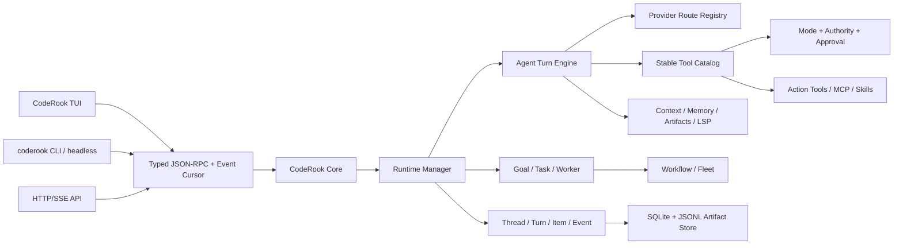

# CodeRook 全面对标 CodeWhale 的 Spec-Driven 开发文档

> 文档状态: Draft for implementation  
> 编写日期: 2026-07-30  
> CodeRook 基线: `39fd86d39b7d39ff20cd963de7f094c40ca527f5`  
> CodeWhale 基线: `ec08e6e6d55c6bb13d42b357fe0937d04ad42c57`  
> 对标仓库: <https://github.com/Hmbown/CodeWhale>  
> 目标架构: Python 3.12 + Pydantic v2 + asyncio + Textual + 双进程本地运行时

## 0. 执行摘要

CodeRook 已经不是一个简单的 LLM 聊天壳。它拥有类型化 JSON-RPC、常驻 Core、
异步 Agent Loop、工具权限、会话恢复、结构化上下文压缩、项目记忆、Subagent、任务板、
Checkpoint、Worktree、Skills 和 MCP 等基础模块。

与 CodeWhale 的主要差距不在“有没有工具”，而在以下五个系统级能力:

1. **统一运行时语义**: TUI、CLI、Subagent、后台任务应使用同一套
   Thread/Turn/Item/Event 生命周期，而不是各自维护近似状态。
2. **模式与权限分离**: Plan/Act/Operate 决定工作方式，Ask/Auto Review/Full Access
   决定执行权限，两者不能混为一个开关。
3. **持久化多 Agent 控制面**: Worker 需要状态、心跳、预算、写入声明、证据、重试和
   重启恢复，而不只是内存中的 `asyncio.Task`。
4. **稳定且可发现的工具面**: 默认只暴露少量 action-family 工具，其余工具延迟加载，
   保证 schema 稳定、降低上下文成本，并对权限按 action 进行裁剪。
5. **可观测与可恢复**: 每次 turn 的有效模型、权限、工具、token、产物、失败原因和恢复点
   都应从持久记录中重建，而不是依赖 TUI 当时显示过什么。

本路线不建议逐行复制 CodeWhale。CodeWhale 已是大型 Rust workspace，但其当前 TUI
运行时仍集中在多个超大文件中，官方架构文档也把继续拆分列为后续工作。CodeRook 应吸收它的
运行时契约、持久化和安全机制，同时保留自身更清晰的类型化、异步、双进程边界。

---

## 1. 阅读范围与事实边界

### 1.1 CodeWhale 阅读范围

本次审阅覆盖了 CodeWhale 的 Rust workspace、运行入口、核心 turn loop、工具注册表、
上下文压缩、Provider、模式/权限、Subagent、Task、Runtime Thread、Workflow、Fleet、
Work Graph、Hooks、Skills、Memory、Sandbox、Runtime API、TUI 命令和相关设计文档。

重点源码位置:

| 领域 | CodeWhale 真实来源 |
|---|---|
| 主运行时 | `crates/tui/src/core/engine.rs` |
| Turn Loop | `crates/tui/src/core/engine/turn_loop.rs` |
| Tool Catalog | `crates/tui/src/core/engine/tool_catalog.rs` |
| Tool Registry | `crates/tui/src/tools/registry.rs` |
| 上下文压缩 | `crates/tui/src/compaction.rs` |
| Stuck Guard | `crates/tui/src/core/engine/stuck_guard.rs` |
| Prefix Cache | `crates/tui/src/prefix_cache.rs` |
| Runtime Thread | `crates/tui/src/runtime_threads.rs` |
| 持久任务 | `crates/tui/src/task_manager.rs` |
| Work Graph | `crates/tui/src/work_graph/` |
| LSP | `crates/tui/src/lsp/`、`core/engine/lsp_hooks.rs` |
| Subagent | `crates/tui/src/tools/subagent/mod.rs` |
| Fleet | `crates/tui/src/fleet/` |
| Workflow | `crates/tui/src/tools/workflow.rs`、`crates/workflow/` |
| Provider | `crates/config/src/`、`crates/tui/src/config.rs` |
| Hooks | `crates/tui/src/hooks/` |
| App Server | `crates/app-server/` |

参考文档:

- `docs/ARCHITECTURE.md`
- `docs/AGENT_RUNTIME.md`
- `docs/TOOL_SURFACE.md`
- `docs/MODES.md`
- `docs/SUBAGENTS.md`
- `docs/PROVIDERS.md`
- `docs/SANDBOX.md`
- `docs/MEMORY.md`
- `docs/SKILLS.md`
- `docs/HOOKS.md`
- `docs/AUTOMATIC_WORKFLOWS.md`
- `docs/WORKFLOW_AUTHORING.md`
- `docs/FLEET.md`
- `docs/reference/RUNTIME_API.md`
- `docs/RECEIPTS.md`

### 1.2 必须保留的事实限定

1. CodeWhale 已拆出多个 crate，但 **TUI crate 仍是当前运行时事实来源**，不能描述为已经
   完成彻底模块化。
2. CodeWhale 的 runtime turn receipt 文档仍包含“proposed”接口，不能描述为全部实现。
3. CodeWhale hooks 当前主要在 TUI 路径生效，不能描述为所有 headless/API 路径已统一。
4. CodeWhale 的 Subagent 向 Fleet 统一仍在演进，短任务 Agent 与耐久 Fleet Worker
   不是完全相同的一条实现链。
5. CodeWhale 代码量大且存在多个万行级文件。CodeRook 应复制契约与行为，不复制单体结构。

---

## 2. CodeWhale 的核心设计拆解

### 2.1 Agent Turn Loop

CodeWhale 的 turn loop 不只是“调用模型并执行工具”，还处理:

- turn 前 steer 消息和子 Agent 完成事件。
- 自动压缩与 context overflow 恢复。
- 临时工作状态、working set 和 LSP diagnostics 注入。
- 流式 chunk timeout、wall timeout、最大字节限制和透明重试。
- schema 稳定性与 prefix cache 漂移检查。
- 工具调用的权限、模式、caller、hook、approval、policy 多层预检。
- 修改工具执行前 snapshot。
- 工具输出按类型压缩或 spill 到 artifact。
- 并行工具资源规划。
- 重复 read 合并、stuck guard 和重复步骤检测。
- tool call/result 协议配对。

CodeRook 当前已有重试、压缩、工具输出分级、只读并行和协议修复，但还缺少统一的
stream watchdog、stuck guard、resource claims、prefix stability 和 LSP repair loop。

### 2.2 工具面

CodeWhale 默认模型可见工具不是几十个平铺名字，而是稳定 action family:

- `Bash`: run/wait/interact/cancel
- `File`: read/list/search_name/search_content/write/edit/patch
- `Git`: status/diff/log/show/blame
- `Run`: tests/verifiers
- `agent`
- `remember`
- `tasks`
- `update_plan`
- `work_update`
- `tool_search`

源码中的默认 registry 名单是 `Bash`、`File`、`Git`、`Run`、`agent`、`remember`、
`tasks`、`work_update`；`update_plan` 和合成的 `tool_search` 在其他装配路径加入。
Web、GitHub、Automation、RLM 和大部分 MCP 工具延迟加载。

值得移植的不是工具名称本身，而是:

1. schema 按名称稳定排序和 memoize。
2. active head 与 deferred tail 分区，激活工具只追加尾部。
3. 工具 action 具有独立 capability、approval 和 authority。
4. 模型可通过 `tool_search` 发现延迟工具。
5. 旧别名只用于 transcript replay，不再暴露给模型。
6. 大结果通过 typed metadata 摘要或 artifact handle 返回。

### 2.3 模式、权限和安全

CodeWhale 把三类概念分开:

- **Mode**: Plan、Act、Operate。
- **Permission posture**: Ask、Auto Review、Full Access。
- **Workspace trust/sandbox**: 项目是否可信以及操作系统是否真的提供隔离。

Plan 是只读工作方式；Act 直接执行；Operate 倾向将独立或长任务交给 Worker，但权限上限
与 Act 相同。权限姿态不能提升 Mode 的能力，Worker profile 也只能设权限上限，不能绕过
父会话。

其 Sandbox 文档明确说明 Windows 当前没有等价 OS sandbox，不用 approval 冒充 sandbox。
这一点应成为 CodeRook 的产品原则。

### 2.4 Provider 与凭据

CodeWhale 维护显式 Provider Registry，支持 OpenAI Chat Completions、OpenAI Responses、
Anthropic Messages 和本地兼容服务。Provider、wire protocol、model、base URL、credential
source 是独立字段，模型 ID 前缀不能偷偷切换 Provider。

安全上值得移植:

- 用户级配置可设置 Provider、base URL 和 key。
- 项目级配置不得重定向 Provider 或注入密钥。
- 非 loopback 的 `http://` 默认拒绝。
- 密钥优先进入系统 keyring，配置文件只保存引用或非敏感信息。
- `doctor` 只报告 key 是否存在和来源，不显示正文。
- 每个 turn 持久化实际生效 route，而不是只保存默认配置。

CodeRook 已支持 Anthropic-compatible 和 OpenAI-compatible，并将密钥从普通配置分离。下一步
不是立刻支持 30 个厂商，而是把两个 wire format 抽象为可靠的 route registry，并增加
per-profile route、能力和实际路由回执。

### 2.5 Subagent、Task、Workflow 与 Fleet

CodeWhale 的多 Agent 被分成四层:

- `agent`: 短生命周期的委派工具。
- `tasks`: 持久任务、依赖、gate、attempt、artifact 和 timeline。
- `workflow`: 顺序、分支、循环、fan-out/fan-in、预算和审查策略。
- `fleet`: 有 lease、heartbeat、retry、ledger、host adapter 的耐久 worker 控制面。

Subagent 角色包含 worker/scout/planner/reviewer/builder/verifier/consultant/custom。写入型
Worker 必须声明 write authority，并给出 `write_roots`、`exact_files` 或协调契约。Worktree
隔离和写权限是两个不同概念。多个 worker 写入范围冲突时，在执行修改前 fail closed。

CodeRook 已有 planner/executor/reviewer、嵌套深度 2、前后台运行、共享 TaskManager、工具白名单
和 Worktree，但后台状态只在内存中，daemon 重启会丢失，也没有 heartbeat、shared token
budget、write claims、structured child receipt 和 retry policy。

### 2.6 Runtime Thread 与 API

CodeWhale 使用 Thread/Turn/Item/Event 作为耐久运行时模型:

- Thread 表示持续会话和默认 route。
- Turn 表示一次用户输入到终态的执行。
- Item 表示 message、tool call、tool result、artifact 等。
- Event 使用单调递增 `seq` 支持 replay + live stream。

App Server 在该模型之上提供 HTTP/SSE、stdio JSON-RPC、interrupt、steer、resume、fork、
usage 和 capabilities。`exec --output-format stream-json` 使用相同事件词汇。

CodeRook 的双进程 TCP JSON-RPC 是很好的基础，但目前协议主要围绕 session/run command，
缺少可重放 runtime event cursor、turn/item 查询和 capability introspection。

### 2.7 上下文、记忆和恢复

CodeWhale:

- 自动压缩，保留 working set、pins 和 recent context。
- 对不同工具输出采用结构化压缩。
- 检查 prefix cache 稳定性。
- 使用 checkpoint/offline queue/session restore/side-git snapshot 支持恢复。
- Memory 是 opt-in 的用户级 Markdown 规则，不是向量数据库。

CodeRook:

- 已实现结构化 Pydantic 摘要、约 25% 最近原文、增量摘要、质量门禁和 tool pair 校验。
- 已实现项目级结构化记忆、来源追踪、脱敏和中英文确定性词法检索。
- 已实现内容寻址 checkpoint，并在 rewind 时检查并发变更。

因此 CodeRook 的压缩和记忆不应推倒重来。后续重点是 working set、artifact handle、prefix
stability、turn-level snapshot 和可观察恢复状态。

---

## 3. CodeRook 当前真实能力基线

| 领域 | 状态 | 真实评价 |
|---|---|---|
| 双进程架构 | 已实现 | `coderook-core` + CLI/TUI，TCP loopback JSON-RPC/NDJSON |
| 类型化协议 | 已实现 | Pydantic discriminated union，协议文档可生成 |
| Agent Loop | 部分成熟 | 异步、重试、只读并行、工具执行、Todo 注入 |
| Streaming | 已实现 | token 事件可由 TUI 消费，watchdog 仍不完整 |
| OpenAI/Anthropic 接入 | 已实现 | 两类兼容格式和独立凭据，Provider Registry 尚弱 |
| 会话 | 已实现 | 创建、恢复、重命名、分叉、导出、删除、尾部修复 |
| 上下文压缩 | 较成熟 | 结构化、增量、最近窗口、质量门禁、协议配对 |
| 工具注册 | 基础实现 | 全量平铺注册，缺 action family、deferred 和稳定 catalog |
| 权限审批 | 已实现 | allow/deny/ask 与 TUI modal，缺 mode/authority lattice |
| Workspace boundary | 已实现 | 文件和 shell 基础边界，不能等同 OS sandbox |
| Checkpoint | 已实现 | 内容寻址 blob、manifest、冲突检测、rewind |
| Subagent | 部分实现 | 冷上下文、角色、工具裁剪、后台、嵌套、worktree |
| 后台任务 | 基础实现 | daemon 内存状态，重启后不可恢复 |
| Task | 基础实现 | JSON 文件、依赖、claim、owner、软状态机 |
| Memory | 已实现 | 项目级 JSON + Markdown index + 词法检索 |
| Skills | 基础实现 | 内建/用户/项目三级发现，无安装、审计和 provenance |
| MCP | 已实现 | stdio/tcp 接入，可注册动态工具 |
| Hooks | 基础实现 | 4 个内存异步事件，无配置、进程 hook、超时和审计 |
| Worktree | 已实现 | 受管 worktree 创建/列表/删除 |
| LSP | 未实现 | 无 edit 后 diagnostics 和 repair loop |
| Runtime API | 未实现 | 仅内部 TCP client，不是稳定 HTTP/SSE SDK contract |
| Workflow/Fleet | 未实现 | 无 durable worker ledger、lease、gate 和 fan-in |
| TUI | 可用但薄 | 主聊天可用，缺 mode、worker、task、turn inspector |

---

## 4. 全面能力差距矩阵

状态定义:

- `Keep`: CodeRook 已有实现应保留并增强。
- `Port`: 值得从 CodeWhale 的机制中移植。
- `Design`: 需要按 CodeRook 架构重新设计。
- `Defer`: 当前不进入核心里程碑。

| 能力 | CodeWhale | CodeRook | 决策 | 阶段 |
|---|---|---|---|---|
| Thread/Turn/Item/Event | 耐久模型 | session/run/event 分散 | Design | R1 |
| Event seq + replay cursor | 有 | 订阅为主 | Port | R1 |
| Plan/Act/Operate | 有 | 无 | Port | R2 |
| Ask/Auto Review/Full Access | 有 | 部分 | Design | R2 |
| Workspace trust | 独立概念 | 边界但无信任状态 | Port | R2 |
| OS sandbox truth | 平台探测 | 无 | Port | R2 |
| Action-family tools | 有 | 平铺工具 | Port | R3 |
| Deferred tool loading | 有 | 无 | Port | R3 |
| Tool schema memoization | 有 | 无 | Port | R3 |
| Tool caller/authority | 有 | 简单 policy | Design | R3 |
| Large output artifact | 有 | 截断/蒸馏 | Port | R3 |
| Prefix stability | 有 | 无 | Port | R3 |
| Stream watchdog | 有 | 部分重试 | Port | R4 |
| Stuck/read-repeat guard | 有 | 无 | Port | R4 |
| LSP diagnostics | 有 | 无 | Port | R4 |
| Structured compaction | 有 | 有且较强 | Keep | R4 |
| Project memory | 用户 Markdown 为主 | 结构化项目记忆 | Keep | R4 |
| Provider registry | 成熟、多 route | 双格式基础实现 | Design | R5 |
| Secret backend | keyring/file | 凭据文件 | Port | R5 |
| Per-profile provider | 有 | model override 为主 | Port | R5 |
| Route receipt | 大部分可取 | model event 基础 | Design | R5 |
| Durable task timeline | 有 | 简单 JSON task | Port | R6 |
| Goal lifecycle | 有 | ExecutionContext goal | Design | R6 |
| Work Graph | 有 | Todo 列表 | Defer/Port | R8 |
| Durable Subagent | 部分向 Fleet 收敛 | 内存 task | Port | R7 |
| Write claims | 有 | 无 | Port | R7 |
| Shared descendant budget | 有 | 无 | Port | R7 |
| Heartbeat/retry/resume | Fleet 有 | 无 | Port | R7 |
| Workflow IR | 有 | 无 | Design | R8 |
| Fleet ledger | 有 | 无 | Design | R8 |
| Local/SSH host adapter | 有 | 无 | Defer | R9 |
| Hooks lifecycle | 丰富但 TUI 偏置 | 4 个内存事件 | Design | R6 |
| Skills manager/provenance | 有 | loader only | Port | R6 |
| MCP dynamic catalog | 有 | 有但全量 | Keep/Port | R3 |
| HTTP/SSE API | 有 | 无 | Design | R9 |
| ACP/editor bridge | 基础 | 无 | Defer | R10 |
| Web/mobile client | 有 | 无 | Defer | R10 |
| Turn receipt | 仓库中仍有提案内容 | 无 | Design | R9 |
| Doctor/capabilities | 丰富 | config-status/core status | Port | R5 |
| 国际化/语音/社交桥 | 有较多扩展 | 无 | Defer | 不进入主线 |

---

## 5. 目标架构



### 5.1 不可破坏的架构原则

1. **协议先行**: 新命令/事件先定义 Pydantic 模型，再实现 handler，再生成协议文档。
2. **一套运行时**: TUI、CLI、Subagent、Workflow 不得拥有互相不兼容的 turn 状态机。
3. **持久记录优先**: UI 只投影 durable state，不成为事实来源。
4. **权限只能收窄**: child/profile/project config 不能提升 parent authority。
5. **模式不等于权限**: Operate 不是 Full Access，Plan 也不是简单隐藏按钮。
6. **安全声明真实**: Windows 无 OS sandbox 时必须显示 unavailable。
7. **工具协议完整**: 每个 tool call 必须有唯一 terminal result。
8. **上下文有界**: prompt、tool output、hook payload、artifact preview 均必须有上限。
9. **密钥不入项目**: 项目配置不能设置 key 或重定向 base URL。
10. **兼容可迁移**: 所有 schema、状态目录和协议都带版本，迁移幂等。
11. **显式未知**: 无法确认的数据输出 `unknown/unavailable`，不猜测。
12. **避免 CodeWhale 单体化**: 单模块超过 800 行时应评估按领域拆分。

---

## 6. 分阶段开发规格

## R1 - 统一 Runtime Contract

**目标**

建立 Thread/Turn/Item/Event 持久模型，使现有 session/run/event 统一投影到同一运行时。

**建议模型**

```python
class ThreadRecord(BaseModel):
    id: str
    title: str
    workspace: str
    status: Literal["idle", "running", "interrupted", "failed", "archived"]
    default_route_id: str
    created_at: datetime
    updated_at: datetime
    schema_version: int

class TurnRecord(BaseModel):
    id: str
    thread_id: str
    status: Literal["queued", "running", "waiting", "completed", "failed", "interrupted"]
    mode: Literal["plan", "act", "operate"]
    authority_profile: str
    route: RouteReceipt | None
    usage: UsageRecord
    error: ErrorRecord | None

class TurnItemRecord(BaseModel):
    id: str
    turn_id: str
    kind: Literal["message", "tool_call", "tool_result", "artifact", "checkpoint"]
    payload: dict[str, JsonValue]

class RuntimeEventRecord(BaseModel):
    thread_id: str
    turn_id: str | None
    seq: int
    type: str
    payload: dict[str, JsonValue]
    ts: datetime
```

**协议**

- `thread.create/list/get/update/archive`
- `turn.start/get/list/interrupt/steer`
- `turn.items`
- `event.replay(after_seq)`
- `runtime.capabilities`

保留现有 `session.*` 为兼容 facade，内部转换到 runtime service。

**存储**

- 首选 SQLite 保存索引、状态和 seq。
- 大 message/tool output 放 JSONL 或 artifact 文件，只在 SQLite 保存 hash、size、path。
- 每个线程的 `seq` 单调递增，事务内分配。
- 启动时将 `running` 且 boot id 不匹配的 turn 标记为 `interrupted`。

**验收**

- daemon 重启后可查询之前的 thread、turn、item 和 terminal error。
- 客户端断线后使用 `after_seq` 补齐事件，再切到 live subscription，无重复、无缺口。
- session 原有 create/resume/fork/export/delete 测试继续通过。
- 任意 tool call 在 turn terminal 前都有且仅有一个 tool result。

## R2 - Mode、Authority、Trust 与 Sandbox Truth

**目标**

把工作方式、权限姿态、工作区信任和真实 sandbox 能力拆成四个独立维度。

**模型**

```python
class RuntimeMode(StrEnum):
    PLAN = "plan"
    ACT = "act"
    OPERATE = "operate"

class AuthorityProfile(StrEnum):
    ASK = "ask"
    AUTO_REVIEW = "auto_review"
    FULL_ACCESS = "full_access"

class WorkspaceTrust(StrEnum):
    UNTRUSTED = "untrusted"
    TRUSTED = "trusted"

class SandboxCapability(BaseModel):
    available: bool
    kind: Literal["none", "windows_none", "linux_bwrap", "macos_seatbelt"]
    reason: str
```

**规则**

- Plan 隐藏所有 mutation action、任意 shell 和写入型 MCP。
- Act 允许直接工具调用，但仍受 authority/approval/policy 限制。
- Operate 与 Act 权限上限相同，只改变调度偏好。
- Child authority = parent authority ∩ profile ceiling ∩ task scope。
- `Full Access` 不得被描述为 sandbox。
- 运行中 turn 不允许静默切换 mode 或 authority；变更从下一个 turn 生效。

**TUI**

- Header 显示 Mode、Authority、Route 和 workspace trust。
- `Tab` 切 Mode，`Shift+Tab` 切 Authority。
- `/mode plan|act|operate`
- `/permissions ask|auto-review|full-access`
- `/trust status|grant|revoke`
- `/sandbox status`

**验收**

- Plan 模式发给模型的 tool catalog 中不存在 mutation action。
- Operate + Ask 执行写操作仍产生 approval。
- Reviewer child 无论 profile 如何配置都不能超过 parent 的 read-only ceiling。
- Windows 显示 `sandbox unavailable: no OS isolation backend`。

## R3 - Tool Surface V2

**目标**

将平铺工具升级为稳定 action-family catalog，同时保留旧工具名作为内部兼容 alias。

**默认工具**

- `Bash`
- `File`
- `Git`
- `Run`
- `agent`
- `memory`
- `tasks`
- `update_plan`
- `tool_search`

**Action 示例**

```json
{"tool": "File", "action": "read", "path": "README.md"}
{"tool": "File", "action": "patch", "patch": "*** Begin Patch..."}
{"tool": "Bash", "action": "run", "command": "uv run pytest -q"}
{"tool": "Bash", "action": "wait", "process_id": "proc-123"}
{"tool": "Git", "action": "diff", "staged": false}
```

**ToolSpec 必需字段**

- `name`
- `version`
- `description`
- `input_schema`
- `actions`
- `capabilities`: read/write/process/network/git/external
- `approval_requirement`
- `parallel_policy`
- `resource_claims(params)`
- `model_visible`
- `deferred`
- `output_policy`

**Catalog 规则**

1. schema canonicalize 后按工具名稳定排序。
2. catalog memoize，只有显式注册变化才失效。
3. always-active 工具在头部，deferred 工具激活后追加尾部。
4. `tool_search` 使用确定性 BM25/词法评分，返回 name、actions、reason 和 schema handle。
5. MCP 工具默认 deferred，resource discovery 工具可 always active。
6. 旧的 `read_file` 等仅用于 replay 和内部 adapter，不再发给模型。

**大输出**

- 小于 soft limit: 原文。
- soft 到 hard limit: typed summary + head/tail。
- 超过 hard limit: 写入 `.coderook/artifacts/<sha256>`，返回 handle、hash、bytes、preview。
- 增加 `artifact.read(handle, offset, limit)`。

**验收**

- 相同配置连续构建 catalog 的 canonical JSON byte-for-byte 相同。
- 激活 deferred tool 不改变 active head 的 hash。
- Plan 模式按 action 裁剪 `File.write/edit/patch`，而不是隐藏 `File.read`。
- 两个并行 tool claim 同一路径写权限时自动串行。
- 未知 action、未声明 capability 或 caller 不匹配时 fail closed。

## R4 - Turn Loop Reliability、LSP 与 Context

**目标**

增强 loop 可靠性，但保留 CodeRook 现有结构化压缩和记忆实现。

**新增机制**

- Stream idle timeout、wall timeout、max response bytes。
- Provider transient retry 与 no-content retry 分开统计。
- Stuck guard: 记录最近 N 个语义步骤。
- Read repeat guard: 同 path/range/hash 的重复读取返回提示或缓存结果。
- 同一批相同只读调用 coalesce。
- tool execution 前后检查 cancellation。
- 修改工具完成后触发 LSP diagnostics。
- working set 记录最近读取/编辑/诊断文件。
- prefix fingerprint 记录 system prompt、tool catalog 和 stable memory hash。

**LSP V1**

- 自动探测 Python `pyright`/`basedpyright`，后续扩展 TypeScript 和 Rust。
- edit 后等待有限时间收集 diagnostics。
- 每文件最多 20 条，默认只注入 error。
- diagnostics 作为 transient context，不永久污染历史。
- 连续修复次数有上限，超过上限要求模型报告阻塞。

**保持不变**

- `CompactionSummary` 字段模型。
- 25% recent window 默认值。
- incremental summary。
- tool call/result 配对验证。
- memory 的项目级结构化记录与词法检索。

**验收**

- 模拟永不结束的 stream 时，turn 在 timeout 后进入明确 failed 状态。
- 连续三次相同工具参数和相同结果触发 stuck event。
- Python 文件引入类型错误后，下一模型 step 可看到有界 diagnostics。
- compaction 后用户约束、TODO、错误和路径质量门禁继续通过。
- prefix 改变时记录具体 source，不记录敏感 prompt 正文。

## R5 - Provider Route Registry 与 Doctor

**目标**

将现有两种兼容协议升级为 route-driven Provider 系统，不追求厂商数量。

**V1 Provider**

- `anthropic`
- `openai`
- `openai-compatible`
- `anthropic-compatible`
- `opencode-zen` 作为预设 route

**模型**

```python
class ProviderRoute(BaseModel):
    id: str
    wire_format: Literal["openai_chat", "openai_responses", "anthropic_messages"]
    base_url: AnyHttpUrl
    model: str
    credential_ref: str
    context_window: int | None
    supports_tools: bool
    supports_parallel_tools: bool
    supports_prompt_cache: bool

class RouteReceipt(BaseModel):
    route_id: str
    wire_format: str
    base_url_origin: str
    model: str
    credential_source: Literal["keyring", "file", "env", "missing"]
```

**安全规则**

- 项目 `.coderook` 配置不能设置 `base_url`、credential 或 active provider。
- 非 loopback HTTP 默认拒绝。
- 日志、event、doctor、exception 不出现 key 正文。
- 优先使用 OS keyring；不可用时使用权限收紧的 credentials file。
- 每个 agent profile 可 pin route，但必须引用用户已配置 route。

**命令和 TUI**

- `coderook configure`
- `coderook provider list`
- `coderook provider add/edit/remove/test`
- `coderook model list`
- `/provider`
- `/model`
- `/doctor`

**验收**

- 首次启动无配置时进入向导。
- 切换 OpenAI/Anthropic route 不覆盖另一 route 的 key。
- `doctor --json` 只显示 credential presence/source。
- 自定义 endpoint 返回 401、TLS、schema、model error 时给出分类错误。
- TurnRecord 保存实际 route receipt。

## R6 - Durable Task、Goal、Hooks 与 Skills

**目标**

把当前简单任务文件升级为可审计的工作控制面，并补齐扩展生命周期。

**Task 模型**

- status: pending/ready/running/blocked/completed/failed/cancelled。
- dependencies。
- owner worker。
- attempts。
- acceptance criteria。
- gates。
- artifacts。
- timeline。
- created_by/updated_by。

**Goal 模型**

- objective。
- status: active/blocked/completed。
- token budget、elapsed time。
- constraints。
- linked task ids。
- completion evidence。

Goal 是用户级目标，Task 是执行单元，Plan 是对话展示，三者不得混成一个列表。

**Hooks V2**

- `session_start`
- `message_submit`
- `turn_start`
- `tool_call_before`
- `tool_call_after`
- `approval_requested`
- `compaction_completed`
- `worker_started`
- `worker_finished`
- `turn_stop`
- `session_stop`

每个 hook 必须配置 timeout、blocking、command、conditions 和 trusted scope。Payload 必须
版本化、有界、脱敏；进程树在 timeout 时终止；非阻断 hook 使用有界队列。

**Skills V2**

- 继续支持 builtin/user/project 优先级。
- 加入 manifest、digest、source、installed_at 和 trust。
- `/skills list/show/install/remove/audit`。
- 项目只能写 `.coderook/skills`，兼容目录只读导入。
- 安装前 preview，安装后 digest 校验。

**验收**

- daemon 重启后 task timeline、attempt 和 artifact 可查询。
- 任务依赖未满足时不能 claim。
- blocking hook 超时按配置 fail closed/fail open，并记录结构化 event。
- hook payload 不含 API key 和超大 tool output。
- skill 被修改后 digest mismatch 在执行前可见。

## R7 - Durable Subagent V2

**目标**

将后台 Subagent 从内存 `asyncio.Task` 升级为可恢复 Worker，同时保留轻量前台调用。

**统一工具**

`agent` actions:

- `start`
- `status`
- `peek`
- `wait`
- `cancel`
- `followup`

**WorkerRecord**

- worker id、parent turn、root goal。
- role/profile/route/model。
- status 和 status reason。
- depth/max steps/wall time。
- workspace/worktree/branch。
- authority ceiling。
- write claims。
- dependencies/acceptance。
- heartbeat/lease。
- token budget/usage。
- summary/changes/evidence/risks/blockers。
- event cursor、artifact handles。

**Write Claim**

写入型 worker 必须声明以下至少一种:

- `exact_files`
- `write_roots`
- `coordination_contract`

同一 workspace 中相交 claim 在 start 前拒绝；真实独立 worktree 可解除路径冲突，但合并仍需
显式 owner/reviewer。Read-only worker 不需要 write claim。

**预算和恢复**

- 默认最大深度 3，硬上限 8。
- 根 goal 的 token budget 在所有 descendant 共享。
- heartbeat 间隔必须小于 lease timeout。
- daemon 重启后 stale running worker 变为 interrupted，可 `resume` 或 `retry`。
- retry 有最大次数和 backoff，不能无限自动重试。

**子结果契约**

```text
SUMMARY
CHANGES
EVIDENCE
RISKS
BLOCKERS
```

**验收**

- daemon 重启后 `agent status` 仍能看到 worker。
- 两个 worker 声明相同文件写权限时第二个 start 失败。
- child route/profile 不能提升 parent authority。
- token budget 用尽时所有 descendant 停止并给出 budget-limited 终态。
- parent 只接收结构化摘要和 bounded events，不注入完整 child transcript。

## R8 - Workflow、Work Graph 与本地 Fleet

**目标**

在 Durable Worker 稳定后增加可复现编排，不把 workflow 逻辑写进 prompt。

**Workflow IR V1**

- sequence
- parallel
- branch
- retry
- review_gate
- reduce/fan_in

**限制**

- 配置采用 TOML/JSON 的声明式 IR。
- V1 不执行任意 Python/JavaScript。
- workflow 有最大节点、深度、并发、token 和 wall-time。
- fan-in 必须指定 owner。
- 高风险写入必须经过 reviewer/verifier gate。

**Work Graph**

- Node: goal/task/worker/gate/artifact。
- Edge: depends_on/produces/reviews/blocks。
- State 通过 event reducer 生成。
- TUI plan 和 task 列表只是 graph projection。

**Fleet V1**

- 仅本地进程 worker。
- SQLite ledger。
- lease、heartbeat、retry、resume。
- profile 固定 route、model、reasoning、authority ceiling。
- 暂不实现 SSH/remote host。

**验收**

- 中途退出 Core，重启后 workflow 从 ledger 恢复，不重复已完成节点。
- parallel 节点遵守 concurrency 和 write claim。
- fan-in 输出引用每个 child evidence。
- gate 失败时下游不运行。
- 相同输入和 route/profile 配置可生成可比较 receipt。

## R9 - Runtime API、Receipts 与 TUI Inspector

**目标**

在统一 runtime 之上提供稳定本地 API 和完整可观测界面。

**HTTP/SSE**

- 默认只绑定 `127.0.0.1`。
- 非 loopback 必须 bearer token。
- `GET/POST /v1/threads`
- `POST /v1/threads/{id}/turns`
- `POST /v1/turns/{id}/interrupt`
- `POST /v1/turns/{id}/steer`
- `GET /v1/threads/{id}/events?after_seq=`
- `GET /v1/turns/{id}/items`
- `GET /v1/turns/{id}/receipt`
- `GET /v1/capabilities`
- `GET /v1/usage`

**Turn Receipt**

- route/model/wire format。
- mode/authority/trust/sandbox truth。
- started/finished/status。
- token usage，价格未知时 cost=`unknown`。
- tool counts 和 approval counts。
- files changed、checkpoints、artifacts。
- worker summaries。
- verification evidence。
- error classification。

Receipt 必须由 durable records 纯函数生成，缺失数据显式标记 unavailable。

**TUI**

- 主 transcript 保持简洁。
- 左侧或可切换面板: Tasks/Workers/Workflow。
- Turn Inspector: route、usage、tools、approvals、diagnostics、artifacts、receipt。
- `/context`: token、working set、memory、summary、tool schema 开销。
- `/workers`、`/tasks`、`/workflow`、`/turn`、`/doctor`。
- compaction 显示触发原因、前后 token、保留窗口和摘要路径。

**验收**

- SSE reconnect 可从 cursor 无缝恢复。
- API 与 TUI 查询同一个 turn 得到相同 status/usage。
- receipt 不依赖当前 Core 内存，可离线从 store 构建。
- 无 token 时非 loopback bind 启动失败。
- TUI 退出不影响运行中 durable worker。

## R10 - 延后能力

下列能力只有在 R1-R9 稳定后再评估:

- ACP/Zed/VS Code 集成。
- Web 和移动端。
- SSH/remote fleet host。
- 多语言 UI。
- Voice。
- Slack/Discord/Telegram 等桥接。
- RLM 或持久代码执行 kernel。
- 30+ Provider 厂商预设。

这些功能展示性强，但在统一运行时和恢复链不稳定时会放大维护成本，不应抢占主线。

---

## 7. 推荐的首批 PR

### PR-01: `feat(runtime): add durable thread turn item event records`

- 新模型、SQLite schema、event seq。
- 现有 session facade 保持不变。
- 先完成写入与查询，不改 TUI 布局。

### PR-02: `feat(runtime): replay events with cursor and recover interrupted turns`

- replay/live 无缝衔接。
- boot id 与 interrupted recovery。
- tool pair invariant 检查。

### PR-03: `feat(authority): separate runtime mode from permission posture`

- Plan/Act/Operate。
- authority lattice。
- TUI header 与切换。
- Windows sandbox truth。

### PR-04: `feat(tools): introduce stable action-family catalog`

- ToolSpec V2、canonical schema、memoization。
- File/Git/Run 先迁移，Bash process lifecycle 后续单独 PR。
- 旧工具 replay alias。

### PR-05: `feat(tools): add deferred discovery and artifact spillover`

- `tool_search`。
- MCP deferred。
- artifact store/read。
- catalog head hash 测试。

### PR-06: `feat(agent): persist workers and enforce write claims`

- WorkerRecord。
- start/status/peek/wait/cancel。
- daemon restart recovery。
- write overlap fail closed。

只有 PR-01 至 PR-06 通过后，才进入 Workflow/Fleet 和 HTTP API。

---

## 8. 测试策略

### 8.1 每个阶段的测试层

| 层 | 重点 |
|---|---|
| Model unit | Pydantic schema、enum、版本、迁移、序列化 |
| Policy unit | mode/authority/trust/action 组合矩阵 |
| Store unit | 事务、seq、幂等、损坏尾部、并发写 |
| Loop unit | retry、timeout、stuck、cancel、tool pair |
| Integration | 真 daemon、断线重连、重启恢复、worker resume |
| TUI unit | header、审批、worker/task projection、快捷键 |
| Packaging | wheel 安装、entry point、旧状态读取 |
| Security | secret redaction、路径边界、非 loopback auth |

### 8.2 必须新增的故障注入

- Provider 在半个 JSON tool call 后断流。
- Tool 执行后 Core 在 result 持久化前退出。
- SQLite transaction 中断。
- Event client 在 seq N 后断线。
- Worker 心跳停止。
- Worktree 有未提交修改。
- LSP 不存在、启动失败、超时、返回超大 diagnostics。
- Hook 卡死、输出超大、输出包含 secret。
- Artifact 文件丢失或 hash 不匹配。

### 8.3 每次 push 的完整 gate

```powershell
uv run ruff check .
uv run mypy src
uv run mypy --platform linux src
uv run pytest -q
uv run python scripts/gen_protocol_doc.py --check
uv build
uv run python scripts/smoke_wheel.py dist
```

新增 bus model 后必须重新生成并提交 `WIRE_PROTOCOL.md`。任何一步失败都阻止 push。

---

## 9. 里程碑和完成定义

| 里程碑 | 包含阶段 | 用户可感知结果 |
|---|---|---|
| M1 可靠单 Agent | R1-R5 | 可恢复 turn、清晰模式权限、稳定工具面、LSP、Provider route |
| M2 可靠多 Agent | R6-R7 | 任务和 worker 可审计、可恢复、可限权 |
| M3 可编排 Agent | R8 | Workflow/Fleet 可重启恢复和显式 fan-in |
| M4 可集成运行时 | R9 | HTTP/SSE、receipt、完整 TUI inspector |
| M5 生态扩展 | R10 | IDE/Web/remote 等可按需求接入 |

### 项目级 Definition of Done

CodeRook 达到“全面对标 CodeWhale 的核心 Agent 能力”需要同时满足:

1. TUI、CLI、headless、worker 使用同一 Thread/Turn/Item/Event 状态。
2. 任意 turn 可在重启后解释“做了什么、使用什么 route、为何停止”。
3. Mode、authority、trust、sandbox 四者可独立观察和验证。
4. 默认工具面有界、稳定、可发现，权限按 action 裁剪。
5. 上下文压缩、记忆、artifact、working set 和 LSP 协同工作。
6. Worker 有持久状态、预算、写声明、heartbeat、evidence 和恢复路径。
7. Workflow 的并行、gate、fan-in 和失败语义可测试。
8. TUI 不依赖私有内存状态，所有关键状态来自运行时查询。
9. 本地 API 默认安全，密钥永不出现在日志、事件、receipt 和项目配置。
10. 完整 CI gate 在 Windows 和 Linux 类型检查下持续通过。

---

## 10. 最终取舍

CodeRook 不应成为“Python 版 CodeWhale”。更合理的定位是:

> **一个类型化、异步、可恢复的本地 Coding Agent Runtime，以精简 TUI 为主界面，
> 用可靠的上下文治理和持久化多 Agent 协作完成真实软件工程任务。**

CodeWhale 最值得吸收的是 runtime contract、模式与权限分离、稳定工具面、durable worker、
write claims、event replay 和 receipt 思维。CodeRook 最值得保留并形成自身特色的是:

- Python/Pydantic 带来的协议透明度和开发效率。
- Core/TUI 双进程边界。
- 已经较成熟的结构化上下文压缩。
- 项目级、可追踪、确定性召回的长期记忆。
- 内容寻址且带冲突检测的 checkpoint。
- 更小、更容易测试和讲清楚的实现规模。

首要顺序应是 **统一运行时 -> 模式权限 -> 工具面 -> durable worker**。
在这条主线完成前，不应优先投入 Web、移动端、几十个 Provider 或远程 Fleet。
