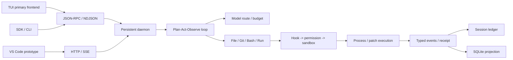

# CodeRook 项目案例

> 更新于 2026-08-20。项目处于公开 Beta 前，发布评分卡为 **NO-GO**；本文只使用仓库可复现证据。

## 一句话定位

CodeRook 是我独立设计并实现的本地优先 Coding Agent runtime：一个持久 daemon 统一管理模型路由、
工具、权限、会话、恢复和多 Agent 工作流，TUI、Python SDK、HTTP/SSE 与 VS Code 原型共享同一套
类型化协议和可审计状态。

## 问题与职责

普通 Agent demo 可以完成一次“模型调用工具”，但代码任务还要求理解仓库、约束写入、执行验证、
处理中断、恢复长任务，并让用户知道模型做了什么。项目为个人项目，我负责需求拆解、架构、Python
runtime、TUI、协议、测试、评测与发行链路；模型推理由第三方 provider 提供，Textual、Pydantic、
bubblewrap/Seatbelt、SQLite、Syft 和 Sigstore 等是明确列出的基础设施，不计作本人自研成果。

## 核心架构

daemon 是状态所有者，客户端可退出和重连；文件 ledger 保存操作真相，SQLite 是可查询投影。所有 IPC
命令和事件使用 Pydantic 判别联合，生成 `WIRE_PROTOCOL.md`，避免 TUI、SDK 与 daemon 靠隐式 JSON
约定演进。

## 五个关键取舍

1. **daemon/client 而非单进程 CLI**：换取后台任务、断线重连和多客户端一致状态，代价是认证、协议与
   崩溃恢复复杂度；因此只监听 loopback、要求首帧 token，并维护 durable event replay。
2. **protocol-first 而非 UI 直读状态**：管理面板、SDK 与外部集成都走类型化命令；协议改动由生成文档
   和兼容测试约束。
3. **file ledger + SQLite projection**：append-only ledger 便于恢复与审计，SQLite 便于查询；reconcile
   负责中断后的幂等投影，不把两个存储都称为不可冲突的“真源”。
4. **fail-closed 权限而非假沙箱**：工具依次经过 schema、Hook、六层权限、sandbox plan 与执行策略。
   Windows 没有受支持的文件/网络强制后端时明确显示 degraded 并回到 ASK。
5. **自研轻量 loop/workflow 而非套 Agent 框架**：保留工具、route、receipt 和恢复语义的控制权；外部
   知识、MCP、Skill 与 Hook 作为扩展，不让向量 RAG 成为 Coding Agent 的强依赖。

## 已实现结果

| 结果 | 可复现证据 | 能证明什么 |
|---|---|---|
| 双进程 durable runtime、TUI/SDK/HTTP 接口 | `docs/reference/FUNCTIONAL_ARCHITECTURE.md`、协议与集成测试 | 生命周期与接口合同成立 |
| File/Git/Bash/Run、PatchPlan、权限与恢复 | 单元/集成测试、`docs/reference/THREAT_MODEL.md` | 内部安全边界和降级行为成立 |
| task/subagent/fleet/worktree/workflow | workflow ledger、租约、写声明和恢复测试 | 编排与并发约束成立 |
| 50 任务评测集与公开适配器 | `docs/reference/PUBLIC_BENCHMARKS.md`、离线 verifier 合同 | harness 可复现，不代表真实模型成绩 |
| 1,000+ 自动测试与三平台 workflow | `docs/status/RELEASE_SCORECARD.md`、`.github/workflows/` | 本地工程门禁完整；远端最新状态需另查 |
| SBOM、checksums、OIDC attestation、keyless signing | `docs/operations/RELEASING.md` | 发布链路定义完整；首次真实 tag 仍未产生 |

当前最重要的未完成项不是继续堆功能，而是真实模型 pass@1、公开 benchmark 官方判分、active main
ruleset、跨已发布 tag 升级和首次公开 attestation。三平台 clean distribution、官方 MCP、三平台各
100 次强杀恢复及历史 commit 到当前候选的安装态升级/备份回滚已有远端证据；剩余门禁未通过前，
仍不把项目写成“生产就绪”。

## 可用于简历的压缩版本

**CodeRook｜本地优先 Durable Multi-Agent Coding Runtime｜个人项目**

- 独立设计 daemon/client 双进程 Coding Agent，以类型化 JSON-RPC/NDJSON 与 HTTP/SSE 统一 TUI、SDK、
  headless 和 VS Code 原型，支持 durable thread/turn、断线重放、上下文压缩与 Turn Receipt；
- 构建 File/Git/Bash/Run 工具链与六层权限决策，实现事务 PatchPlan、hash 冲突检测、checkpoint/rewind，
  Linux/macOS 接入 OS 沙箱，Windows 不支持时 fail-closed 降级为人工审批；
- 实现 task/subagent/fleet/worktree/event-sourced workflow，通过预算、租约和写声明约束并发修改与崩溃恢复；
- 建立 50 任务离线评测、公开 benchmark 适配器和 1,000+ 自动测试门禁，并设计三平台构建、SBOM、
  provenance 与无密钥签名链路；真实模型成绩与远端发布证据仍按 NO-GO 评分卡管理。

数字使用边界和可点击证据见[简历证据账本](RESUME_EVIDENCE.md)，讲解路径见[面试指南](INTERVIEW_GUIDE.md)。
